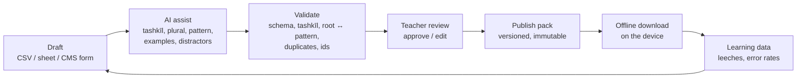

# Suffa — Content Plan

- Date: 2026-09-23 · Status: proposed · Owner: product owner + teacher
- Related: ADR-0003, ADR-0014 (CMS + offline bundles), ADR-0021 (languages),
  ADR-0023 (sources, licensing, packs), `docs/didactics.md`

## 1. Where we are

| Item                     | Today                            | Book 1 needs (estimate)      |
| ------------------------ | -------------------------------- | ---------------------------- |
| Units                    | 3 (demo)                         | 16                           |
| Vocabulary               | 10 words                         | ≈ 800–1,000 words            |
| Dialogues                | 2                                | ≈ 3 per unit (≈ 48)          |
| Verbs with full tables   | a few                            | ≈ 60–80                      |
| Grammar points           | none as learnable items          | ≈ 3–4 per unit               |
| Example sentences        | none                             | 1–2 per word                 |
| Audio                    | links to publisher/archive audio | per word + per dialogue line |
| Alphabet / pronunciation | minimal pairs only               | a short course for beginners |

Content lives as JSON in the public repo (ADR-0003) and can only be changed by developers.
**Content is the bottleneck for the pilot** — the platform is ahead of plan, the material is
not. Numbers for Book 1 are estimates; the teacher confirms them in the inventory (C0).

## 2. Goals

1. **Pilot (Jan 4):** the units the class works on from January to March are complete
   (vocabulary, example sentences, audio, grammar drills, teacher dialogues), plus the
   alphabet course for newcomers.
2. **End of pilot (Mar):** all 16 units of Book 1.
3. **Later:** Book 2, graded readers, themed packs (numbers & time, travel, at the mosque,
   at the doctor), Qur'anic vocabulary as an optional pack.

## 3. Sources and licensing (ADR-0023)

| Source                                     | Use                                          | Tier          |
| ------------------------------------------ | -------------------------------------------- | ------------- |
| Our own word lists in the book's order     | vocab with meanings, root, pattern, plural   | open          |
| Our own example sentences (teacher + AI)   | cloze, listening, word order                 | open          |
| Tatoeba (CC BY 2.0 FR)                     | extra sentences with translations            | open + credit |
| Wiktionary (CC BY-SA)                      | cross-checking plurals, patterns             | reference     |
| Teacher-written dialogues per unit topic   | reading, listening, role play                | class         |
| Teacher's session recordings (ADR-0018)    | listening, checkpoints, sentence mining      | class         |
| Publisher audio (arabicforall.net)         | linked, never copied                         | link          |
| Muhammad al-Andalusi videos (ADR-0012)     | embedded, with our checkpoints               | link          |
| Neural TTS (Azure / Google, Arabic voices) | audio for words and sentences until recorded | generated     |

Open actions before the pilot: ask the teacher what his school has licensed; write to the
publisher about a classroom licence (a licence would let class packs use book texts directly).

## 4. Content model v2

English field names, stable ids, one format for open and class packs:

```jsonc
{
  "pack": { "id": "book1-unit-04", "version": 3, "tier": "open", "licence": "CC BY 4.0" },
  "units": [{ "id": "b1u04", "book": 1, "unit": 4, "title": { "ar": "…", "de": "…", "en": "…" } }],
  "words": [{
    "id": "w-b-l-d-balad",           // root + lemma, never reused
    "ar": "بَلَد", "tr": "balad",
    "root": "ب ل د", "pattern": "فَعَل", "plural": "بِلَاد",
    "meanings": { "de": ["Land", "Ort"], "en": ["country", "place"] },
    "unit": "b1u04", "tags": ["places"],
    "examples": ["s-b1u04-012"], "audio": "audio/w-b-l-d-balad.m4a",
    "source": "suffa", "licence": "CC BY 4.0"
  }],
  "sentences": [{ "id": "s-b1u04-012", "ar": "…", "de": "…", "en": "…", "words": ["w-b-l-d-balad"] }],
  "grammar":   [{ "id": "g-idafa", "title": {…}, "explanation": {…}, "drills": ["d-…"] }],
  "drills":    [{ "id": "d-…", "type": "cloze|order|transform|choice", "…": "…" }],
  "dialogues": [{ "id": "…", "lines": [{ "speaker": "…", "ar": "…", "de": "…" }] }]
}
```

- `meanings` is an array per language → tolerant checking accepts any one of them (shipped).
- A v1 → v2 loader keeps today's files working; migration is mechanical (script + review).
- User vocabulary (synced) keeps its schema; only the static content changes.

## 5. Pipeline



1. **Draft** — the fastest path for the teacher is a spreadsheet (one row per word: Arabic,
   meanings, unit); the CMS form comes next. Import from CSV and Anki decks.
2. **AI assist** (after P4's gateway; before that, a script with the same prompts): fill in
   tashkīl, plural, pattern and root, propose 2 example sentences and exam distractors.
   Everything AI-made is marked `draft` and never published without review.
3. **Validate** (CI for open packs, publish step for class packs): schema, full tashkīl on
   words, root letters present in the word, pattern matches, duplicate lemmas, broken
   references, id stability against the previous version.
4. **Review** — the teacher approves per unit in the review queue (same queue as AI grading).
5. **Publish** — immutable, versioned pack (ADR-0014); SRS cards survive thanks to stable ids.
6. **Feedback loop** — words with many lapses or confusions surface in the teacher dashboard
   ("top leech words") and become candidates for better examples, mnemonics or images.

Audio: TTS for every word and sentence at publish time (cached in RustFS, ≈ € 1–3 for all of
Book 1), replaced by teacher recordings where he records them.

## 6. Delivery

A content workstream runs in parallel to the sprints. Estimates assume AI drafting + teacher
review: ≈ 2–3 h per unit for the teacher, ≈ 1 h per unit for editing/import.

| When (sprint)        | Content work                                                               | Platform work needed                                                                        |
| -------------------- | -------------------------------------------------------------------------- | ------------------------------------------------------------------------------------------- |
| Now – S3 (Nov 15)    | **C0 inventory** with the teacher: which units in Jan–Mar, what exists     | —                                                                                           |
| S3 (Nov 2 – 15)      | **C1** schema v2 + v1 loader, validator in CI, CSV import script           | 3 pts                                                                                       |
| S4 (Nov 16 – 29)     | **C2** units of the pilot's first month; alphabet course                   | TTS at build/publish, audio per word                                                        |
| S5 (Nov 30 – Dec 13) | **C3** next units; sentence bank; grammar drills (cloze, order, transform) | new exercise types in the trainer (5 pts)                                                   |
| S6 (Dec 14 – 27)     | **C4** remaining pilot units reviewed; teacher dialogues                   | **lean CMS**: class packs, entitlement, review, publish (ADR-0014, pulled forward from S16) |
| S7–S10 (Jan – Feb)   | **C5** rest of Book 1 while the pilot runs, driven by leech data           | CMS forms for the teacher; recordings → sentences                                           |
| after P4             | Book 2, themed packs, graded readers                                       | AI drafting in the CMS                                                                      |

**Proposed plan change:** move a lean version of story 16.x (content CMS + packs) into S6 and
keep S16 for the full CMS. It costs ≈ 8 pts in S6 (holiday sprint, 16 pts); to make room,
teacher badges (engagement) move to S7. This needs the product owner's approval before the
sprint plan is changed.

## 7. Quality bar per unit ("definition of done" for content)

- Every word: full tashkīl, root, pattern where applicable, plural or `null`, ≥ 1 meaning in
  German (English later), audio, ≥ 1 example sentence.
- Every unit: ≥ 1 dialogue or reading text, grammar points with ≥ 5 drills each, an
  end-of-unit check (exam format), teacher approval recorded.
- Validator green; no AI-drafted item unreviewed.

## 8. Risks

| Risk                                  | Mitigation                                                               |
| ------------------------------------- | ------------------------------------------------------------------------ |
| Copyright of book texts               | ADR-0023 tiers; teacher-written dialogues; ask publisher about a licence |
| AI mistakes in tashkīl or meanings    | validator + mandatory teacher review; mark AI items; learners can report |
| Teacher time is limited               | spreadsheet first, AI drafts, editor role for a helper (older student)   |
| Content ids change and reset progress | id rules + id-stability check in the validator                           |
| TTS pronunciation not good enough     | teacher re-records the flagged items; per-item "report audio" button     |
