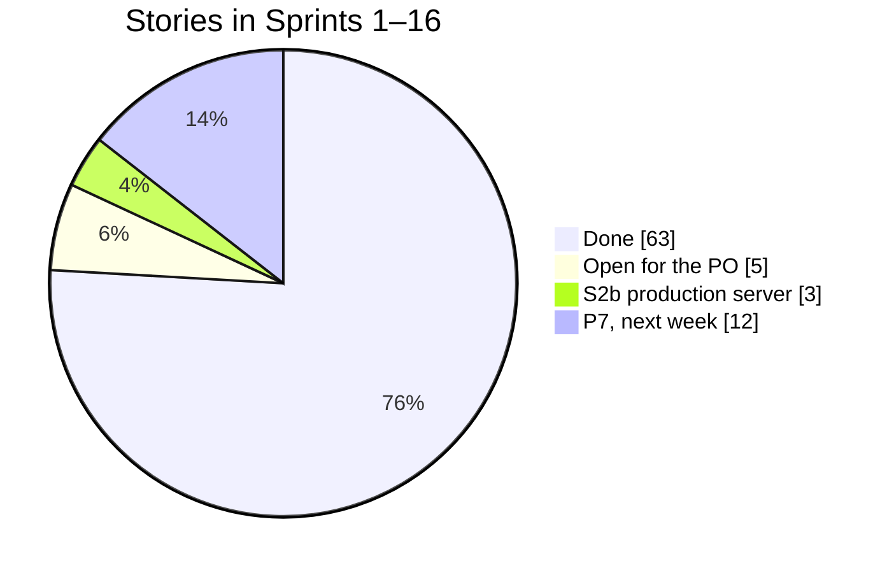
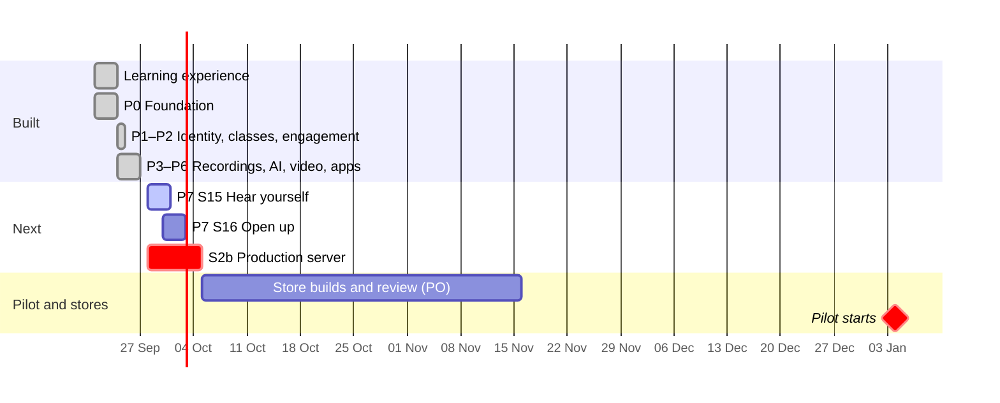

# Suffa — Roadmap

- Date: 2026-09-26 (v3: P0–P6 built, P7 pulled forward) · v2 2026-09-24: re-sequenced for
  the teacher pilot · Cadence: 2-week sprints on paper
- Capacity assumption of the plan: 1 full-time developer (plus AI coding assistants) + product
  owner ≈ 20 story points/sprint. Actual pace since Sep 23: about 80 points a day of code, so
  the plan dates are now buffer, and what is built next goes by [Next](#next-week-of-sep-28--oct-4).

## Where we are (2026-09-26)

**Everything in P0–P6 that code alone can deliver is built** (63 of 68 stories), with tests,
reviews and green releases to staging. Open are the PO's stories: pilot kick-off (4.5),
YouTube outreach (12.4), TestFlight and store assets (13.4, 13.5) and the store release
(14.1). Gates G0 and G1 are met.

| Phase                  | Built (Sep 23 – 26)                                                                                                                                                  |
| ---------------------- | -------------------------------------------------------------------------------------------------------------------------------------------------------------------- |
| Learning experience    | Unit room with focused sections, guided writing, cloze, grammar, alphabet course, levels and stages, "Heute", Entdecken — all offline-first.                         |
| P0 Foundation          | Monorepo, CI, CapRover deploy, API + worker, Postgres queue, verified backups, error tracking, sync endpoints, browser router.                                       |
| P1 Identity & classes  | Magic link + six-digit code + optional passkeys, roles and policies, account devices, admin area with 2FA and audit log, classes with invite QR, GDPR export/delete. |
| P2 Engagement          | Daily quests, streak shields, weekly goal, badges, server recompute, class dashboard, weekly challenge, shout-outs, web push, weekly recap.                          |
| P3 Teacher recordings  | RustFS storage, Google Drive import, resumable uploads, transcode, transcripts, checkpoints, offline audio, assignments.                                             |
| P4 AI teacher          | LLM gateway (Anthropic, OpenRouter, Hugging Face) with quotas and budget, al-Muʿallim with tools and validators, grade mode, teacher review, eval harness in CI.     |
| P5 Interactive YouTube | Video catalog and import, lesson player with checkpoints, tap-to-gloss transcripts when permitted, video quest.                                                      |
| P6 Mobile apps         | Capacitor configuration, bearer tokens, app links, FCM, device reminders, lock-screen controls; weekly leagues, certificates, live class quiz.                       |
| Operations             | Staging and production split (ADR-0024): `main` deploys to staging, production is promoted by digest after approval; Playwright e2e on desktop and phone; Trivy.     |

## Next: week of Sep 28 – Oct 4

1. **Sprint 15 "Hear yourself":** the own recording is scored on the server and can be shared
   with the teacher (pilot feedback), G2P for vocalised MSA, assessor interface with letter
   feedback, pronunciation eval harness, FSRS behind a flag.
2. **Sprint 16 "Open up":** content CMS and versioned offline bundles, English UI and meaning
   language, WCAG 2.2 AA audit, release `v2.2`.
3. **Sprint 2b** as soon as the production server is ordered: production apps, WAL-G backups
   with restore drills, go-live on `suffa.siralabs.org`, staging clean-up.

Stays open after that week, by design: choosing the pronunciation model (needs consented
pilot recordings, January), English content going live (a person reviews it first), and the
stores (devices and accounts). Details: [sprint plan](sprint-plan.md#next-the-week-of-sep-28--oct-4-2026).

## Why this order

A real teacher with a real class is the most valuable thing the project can have. So the
roadmap front-loads what he needs — **accounts, classes, daily/weekly achievements,
notifications and his Google Drive recordings** — and starts the **pilot on 2027-01-04**.
The AI teacher follows, informed by real usage data; YouTube lessons then reuse the
interactive player built for his recordings; app-store apps come once engagement is proven.

## Phases at a glance

Legend: dark = done, highlighted = in progress, light = planned; the red line is today.

| Phase                            | Sprints | Plan dates      | Status      | Outcome / exit criteria                                                                                                       | Release         |
| -------------------------------- | ------- | --------------- | ----------- | ----------------------------------------------------------------------------------------------------------------------------- | --------------- |
| **P0 Foundation**                | S1–S2   | Oct 5 – Nov 1   | ✅ 12/12    | Monorepo, CI, CapRover deploy, API + worker, sync endpoints, Postgres queue, backups, error tracking.                         | `v1.1`          |
| **P0 Production of its own**     | S2b     | —               | ☐ 0/3       | Own production server, WAL-G backups with drills, go-live (ADR-0024). Waits for the server.                                   | —               |
| **P1 Identity, roles & classes** | S3–S4   | Nov 2 – Nov 29  | ✅ 9/10     | Better Auth (link, code, passkeys), RBAC, `ApiSyncProvider`, admin v1, classes + invite links. Open: 4.5 pilot kick-off (PO). | `v1.2`          |
| **P2 Engagement**                | S5–S6   | Nov 30 – Dec 27 | ✅ 9/9      | Quests, shields, weekly goal, badges, server recompute, class spirit, web push, weekly recap.                                 | `v1.3`          |
| **🎓 Pilot starts**              | —       | **Jan 4, 2027** | —           | Teacher's class onboarded.                                                                                                    | —               |
| **P3 Teacher recordings**        | S7–S8   | Dec 28 – Jan 24 | ✅ 10/10    | RustFS, Drive import + upload, transcode, transcripts, checkpoints, offline audio, assignments.                               | `v1.4`          |
| **P4 AI teacher**                | S9–S11  | Jan 25 – Mar 7  | ✅ 13/13    | LLM gateway, al-Muʿallim, grading, evals, review queue.                                                                       | `v2.0-beta`     |
| **P5 Interactive YouTube**       | S12     | Mar 8 – Mar 21  | ✅ 4/5      | Catalog, lesson player, transcripts. Open: 12.4 outreach (PO).                                                                | `v2.0`          |
| **P6 Mobile apps**               | S13–S14 | Mar 22 – Apr 18 | ◐ 6/9       | Built: app bridge, push, reminders, leagues, certificates, live quiz. Open (PO): TestFlight, store assets, store release.     | `v2.1` (stores) |
| **P7 Next level**                | S15–S16 | Apr 19 – May 16 | ▶ next week | Pronunciation assessment, own recordings shared with the teacher, FSRS, content CMS, English UI, accessibility.               | `v2.2`          |

## Milestone gates

1. **G0 (end S2):** one-command deploy to CapRover; restore drill passed. ✅ met 2026-09-23.
2. **G1 (end S4):** RBAC matrix test green; users migrated; teacher can create a class and
   invite. ✅ met 2026-09-24 (nothing to migrate: Supabase held only the PO's data).
3. **G2 (end S6, pilot go/no-go):** engagement loop works offline and on 3 test phones;
   notifications delivered; teacher trained. Built; the phone test and the training are open.
4. **G3 (end S8):** ≥ 5 teacher recordings published with checkpoints; consent recorded.
   Built; needs the teacher's recordings.
5. **G4 (end S11):** tutor eval scores on target; AI cost per active learner ≤ €3. Harness in
   CI; needs a key and pilot usage to measure.
6. **G5 (end S14):** apps approved in both stores; pilot metrics (engagement plan §8) reviewed.
   Needs the store accounts and the pilot.

## Dependencies & risks

| Risk                                          | Likelihood | Mitigation                                                                |
| --------------------------------------------- | ---------- | ------------------------------------------------------------------------- |
| Built ahead of real use: untested on devices  | Medium     | e2e on desktop and phone; iPhone pilot tests by the PO before January.    |
| Recording consent (students, minors) unclear  | Medium     | Consent step in publish flow; audio-only option; per-class AI off switch. |
| Shared RustFS/server capacity with Tabayyun   | Medium     | Transcode concurrency 1, night-time transcription, disk alerts, 8 GB RAM. |
| Gamification boosts activity but not learning | Medium     | Guardrail metric (mature words); XP soft caps.                            |
| Creator permission (al-Andalusi) delayed      | Medium     | YouTube phase is late and embed-only works without transcripts.           |
| AI Arabic vocalisation errors                 | Medium     | Validators, grounding, evals, teacher override loop.                      |
| App-store review rejections                   | Low–Med    | Account deletion, privacy labels, offline value; TestFlight early (S13).  |
| Scope creep                                   | High       | Phase exit criteria; P7 is the buffer.                                    |
