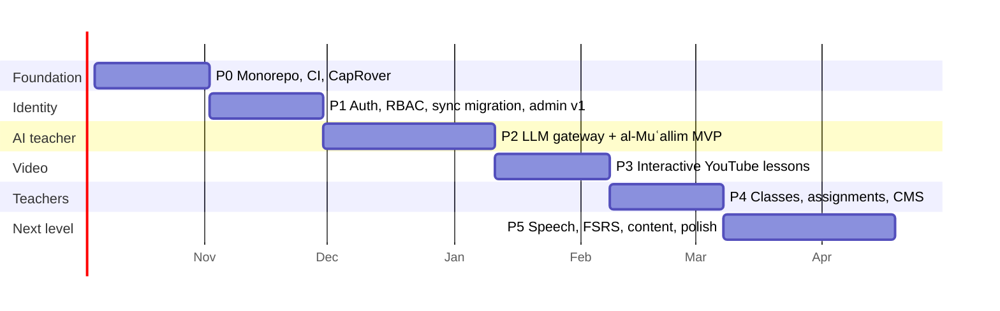

# Suffa — Roadmap

- Date: 2026-09-23 · Cadence: 2-week sprints · Sprint 1 starts **Mon 2026-10-05**
- Capacity assumption: 1 full-time developer (plus AI coding assistants) + product owner (you) ≈ 20 story points/sprint.
  With part-time capacity, stretch every date proportionally; the order stays the same.

## Phases at a glance

| Phase                    | Sprints | Dates (approx.) | Outcome / exit criteria                                                                                                                                    | Release                            |
| ------------------------ | ------- | --------------- | ---------------------------------------------------------------------------------------------------------------------------------------------------------- | ---------------------------------- |
| **P0 Foundation**        | S1–S2   | Oct 5 – Nov 1   | Monorepo, CI green on every PR, staging + prod on CapRover, current PWA served from CapRover, API skeleton with Postgres + health checks, backups running. | `v1.1` (same features, new home)   |
| **P1 Identity & roles**  | S3–S4   | Nov 2 – Nov 29  | Better Auth (magic link, password, passkeys), roles, `ApiSyncProvider`, Supabase data migrated, admin panel v1 (users, roles, audit).                      | `v1.2` — **Supabase switched off** |
| **P2 AI teacher MVP**    | S5–S7   | Nov 30 – Jan 10 | `packages/llm` with Anthropic/OpenRouter/HF adapters, router + quotas + metering, al-Muʿallim Explain/Converse/Grade, eval harness, AI admin page.         | `v2.0-beta` — AI for invited users |
| **P3 Interactive video** | S8–S9   | Jan 11 – Feb 7  | Channel import (Muhammad al-Andalusi), lesson player with checkpoints, transcript pane (if permitted), video progress sync, "ask about this minute".       | `v2.0` public                      |
| **P4 Teacher workspace** | S10–S11 | Feb 8 – Mar 7   | Classes & invites, class dashboards, assignments, AI-grading review queue, content CMS + offline bundles.                                                  | `v2.1` — schools pilot             |
| **P5 Next level**        | S12–S14 | Mar 8 – Apr 18  | Server STT pronunciation, FSRS (with migration), Book 1 complete (16 units), English UI, drills generation via Batch, motivation features.                 | `v2.2`                             |

## Milestone gates

1. **G0 (end S2):** staging deploy is one command; restore-from-backup drill passed.
2. **G1 (end S4):** RBAC matrix test green; all existing users migrated; 0 data-loss reports in 1 week.
3. **G2 (end S7):** tutor eval score ≥ target on golden set; AI cost per active learner ≤ €3 in beta.
4. **G3 (end S9):** permission status from the channel owner recorded; ≥ 20 lessons with checkpoints.
5. **G4 (end S11):** one real teacher runs a class for 2 weeks; teacher NPS ≥ 30.

## Dependencies & risks

| Risk                                       | Likelihood       | Mitigation                                                                   |
| ------------------------------------------ | ---------------- | ---------------------------------------------------------------------------- |
| Creator permission for transcripts delayed | Medium           | Checkpoints work without transcripts; features gated by `permission_status`. |
| AI Arabic vocalisation errors              | Medium           | Validators, grounding in curriculum, evals, teacher override loop.           |
| AI costs exceed budget                     | Low–Med          | Quotas, routing downgrade, caching, Batch API (cost plan §4).                |
| Auth/RBAC bugs leak data                   | Low, high impact | Policy functions + route×role matrix test, security review before G1.        |
| Single VPS outage                          | Low              | Backups + documented restore; add node in P5 if usage grows.                 |
| Scope creep                                | High             | Phases have exit criteria; "Could" features only in P5.                      |
