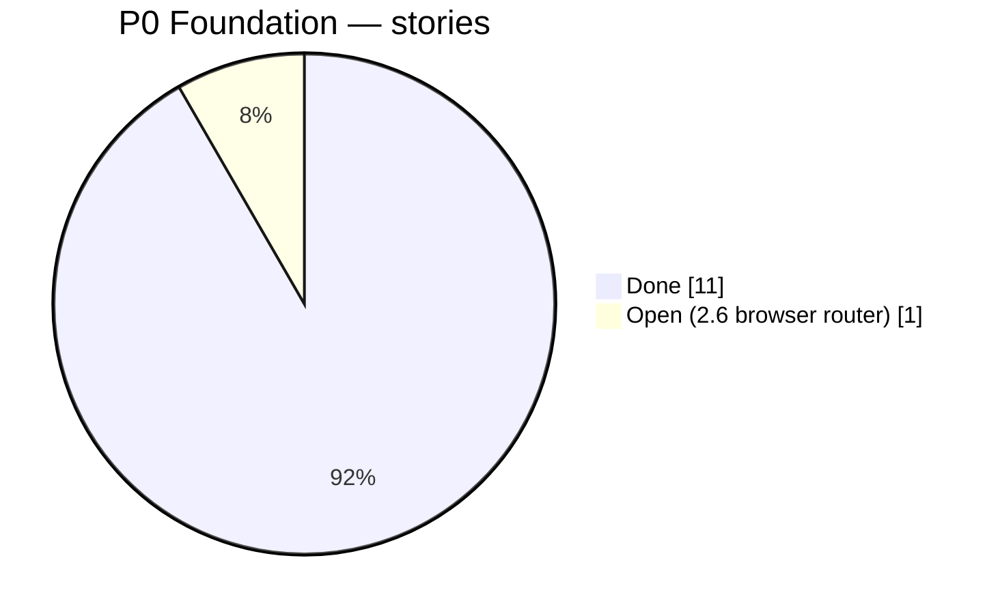
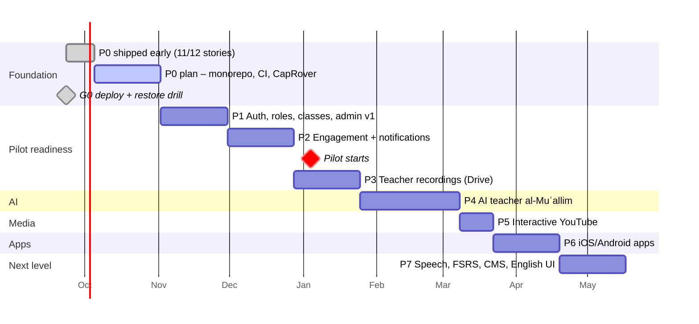

# Suffa — Roadmap

- Date: 2026-09-24 (v2: re-sequenced for the teacher pilot) · Cadence: 2-week sprints ·
  Sprint 1 starts **Mon 2026-10-05**
- Capacity assumption: 1 full-time developer (plus AI coding assistants) + product owner (you)
  ≈ 20 story points/sprint. With part-time capacity, stretch dates proportionally; the order stays.

## Where we are (2026-09-23)

**P0 Foundation is almost done before its planned start:** 11 of 12 stories shipped
(Sprints 1–2 were planned for Oct 5 – Nov 1). Live on CapRover: web, api, worker, database,
nightly verified backups (restore drill passed), job queue, error tracking. Open in P0: 2.6
browser router. **Gate G0 is met.** The dates below are unchanged on purpose: the lead is
buffer for the pilot on Jan 4; P1 (accounts, roles, classes) can start early.

## Why this order

A real teacher with a real class is the most valuable thing the project can have. So the
roadmap front-loads what he needs — **accounts, classes, daily/weekly achievements,
notifications and his Google Drive recordings** — and starts the **pilot on 2027-01-04**.
The AI teacher follows, informed by real usage data; YouTube lessons then reuse the
interactive player built for his recordings; app-store apps come once engagement is proven.

## Phases at a glance

Legend: dark = done, highlighted = in progress, light = planned; the red line is today.

| Phase                            | Sprints | Dates (approx.) | Status  | Outcome / exit criteria                                                                                                                                  | Release               |
| -------------------------------- | ------- | --------------- | ------- | -------------------------------------------------------------------------------------------------------------------------------------------------------- | --------------------- |
| **P0 Foundation**                | S1–S2   | Oct 5 – Nov 1   | ◐ 11/12 | Monorepo, CI, Tabayyun-style CapRover deploy (`docs/ops/caprover-deployment.md`), API + worker, sync endpoints, Postgres queue, backups, error tracking. | `v1.1`                |
| **P1 Identity, roles & classes** | S3–S4   | Nov 2 – Nov 29  | ☐       | Better Auth, RBAC, `ApiSyncProvider`, Supabase migrated, admin v1, **classes + invite links**.                                                           | `v1.2` — Supabase off |
| **P2 Engagement**                | S5–S6   | Nov 30 – Dec 27 | ☐       | XP, daily quests, streaks (TZ-correct) + shields, badges, class weekly challenge, teacher badges, Web Push, weekly recap.                                | `v1.3`                |
| **🎓 Pilot starts**              | —       | **Jan 4, 2027** | —       | Teacher's class onboarded.                                                                                                                               | —                     |
| **P3 Teacher recordings**        | S7–S8   | Dec 28 – Jan 24 | ☐       | RustFS storage, Google Drive import + direct upload, transcode, transcripts, checkpoints, offline audio, assignments.                                    | `v1.4`                |
| **P4 AI teacher**                | S9–S11  | Jan 25 – Mar 7  | ☐       | LLM gateway (Anthropic / OpenRouter / HF), al-Muʿallim explain/converse/drill/grade, evals, review queue.                                                | `v2.0-beta`           |
| **P5 Interactive YouTube**       | S12     | Mar 8 – Mar 21  | ☐       | Muhammad al-Andalusi channel import in the same player.                                                                                                  | `v2.0`                |
| **P6 Mobile apps**               | S13–S14 | Mar 22 – Apr 18 | ☐       | Capacitor iOS/Android, native reminders & push, offline audio, store release, opt-in leagues, certificates.                                              | `v2.1` (stores)       |
| **P7 Next level**                | S15–S16 | Apr 19 – May 16 | ☐       | Server STT pronunciation, FSRS, content CMS, English UI, accessibility.                                                                                  | `v2.2`                |

## Milestone gates

1. **G0 (end S2):** one-command deploy to CapRover; restore drill passed. ✅ met 2026-09-23.
2. **G1 (end S4):** RBAC matrix test green; users migrated; teacher can create a class and invite.
3. **G2 (end S6, pilot go/no-go):** engagement loop works offline and on 3 test phones;
   notifications delivered; teacher trained. → pilot starts Jan 4.
4. **G3 (end S8):** ≥ 5 teacher recordings published with checkpoints; consent recorded.
5. **G4 (end S11):** tutor eval scores on target; AI cost per active learner ≤ €3.
6. **G5 (end S14):** apps approved in both stores; pilot metrics (engagement plan §8) reviewed.

## Dependencies & risks

| Risk                                          | Likelihood | Mitigation                                                                |
| --------------------------------------------- | ---------- | ------------------------------------------------------------------------- |
| Pilot slips because auth/classes take longer  | Medium     | S4 scope has a fallback: invite-by-email only, admin panel minimal.       |
| Recording consent (students, minors) unclear  | Medium     | Consent step in publish flow; audio-only option; per-class AI off switch. |
| Shared RustFS/server capacity with Tabayyun   | Medium     | Transcode concurrency 1, night-time transcription, disk alerts, 8 GB RAM. |
| Gamification boosts activity but not learning | Medium     | Guardrail metric (mature words); XP soft caps.                            |
| Creator permission (al-Andalusi) delayed      | Medium     | YouTube phase is late and embed-only works without transcripts.           |
| AI Arabic vocalisation errors                 | Medium     | Validators, grounding, evals, teacher override loop.                      |
| App-store review rejections                   | Low–Med    | Account deletion, privacy labels, offline value; TestFlight early (S13).  |
| Scope creep                                   | High       | Phase exit criteria; P7 is the buffer.                                    |
