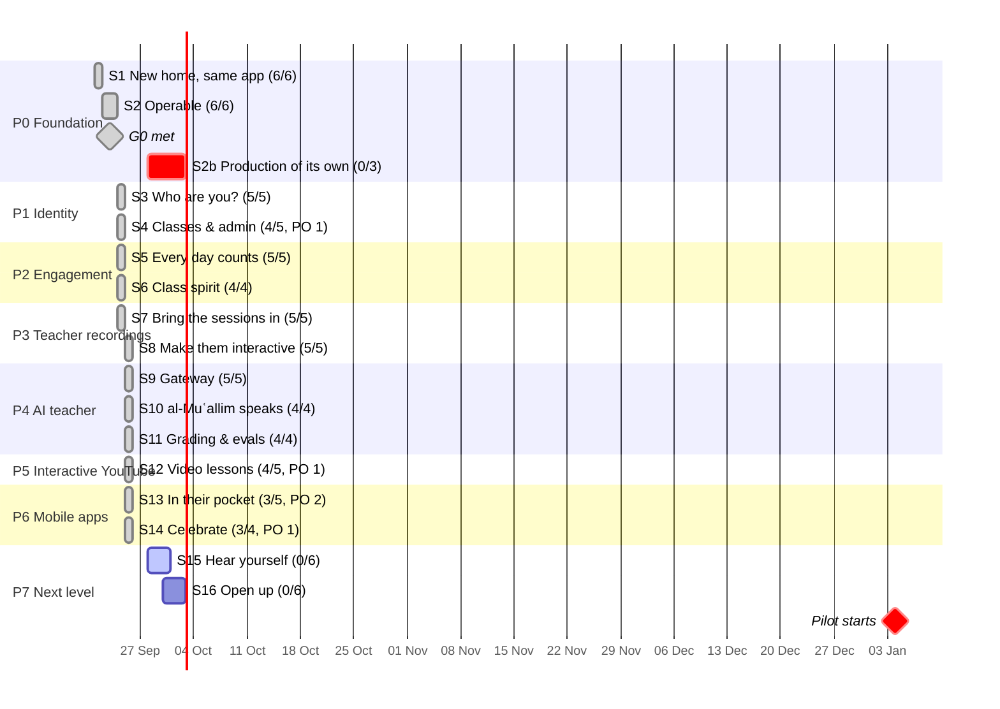
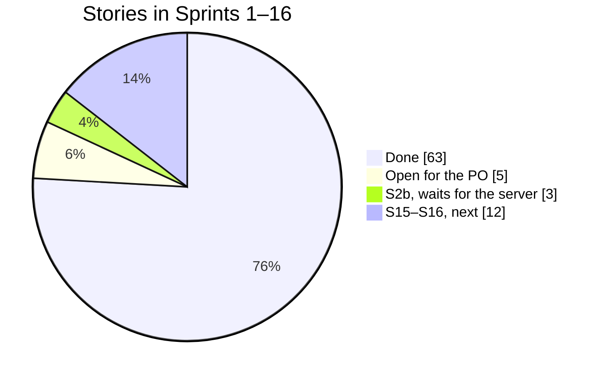

# Suffa — Sprint Plan (S1–S16)

v2 (2026-09-24): re-sequenced for the teacher pilot (engagement + recordings before AI).
v3 (2026-09-26): S1–S14 built; S2b added; S15–S16 detailed and pulled into the week of Sep 28.
Two-week sprints; estimates in story points (1 pt ≈ half a day); target ≈ 20 pts/sprint.

**Definition of Done (every story):** code + tests (unit/integration as relevant) · lint,
typecheck, test green in CI · docs/ADR updated · deployed to staging · acceptance criteria
demoed · no secrets in code · structured logs on new paths.

---

## Progress (as of 2026-09-26)

Sprints 1–14 were planned for Oct 5, 2026 – Apr 18, 2027. Everything in them that can be built
without devices, store accounts or the teacher's class was shipped by Sep 26, 2026: **63 of 68
stories**. The five open ones belong to the PO (pilot kick-off, YouTube outreach, TestFlight,
store assets, store release). Gates G0 and G1 are met; G2–G5 wait for the pilot, real devices
and the stores. Sprint 2b (own production server, ADR-0024) waits for the server.

The calendar dates of the sprints are kept: they are now buffer for the pilot on Jan 4, 2027.
What is built next goes by the "Next" section below, not by those dates.

| Story                    | Status | Notes                                                                                                                                               |
| ------------------------ | ------ | --------------------------------------------------------------------------------------------------------------------------------------------------- |
| 1.1 workspaces           | ✅     | `apps/web`, `apps/api`; `packages/*` follow when code is first shared                                                                               |
| 1.2 CI                   | ✅     | plus: releases are gated on CI and on image smoke tests                                                                                             |
| 1.3 api skeleton         | ✅     |                                                                                                                                                     |
| 1.4 schema + migrations  | ✅     | plain SQL migrations with an own runner (advisory lock); Drizzle not adopted yet                                                                    |
| 1.5 Dockerfiles          | ✅     | ffmpeg is added to the api image with the recordings pipeline (S7)                                                                                  |
| 1.6 first deploy         | ✅     | full stack live on CapRover                                                                                                                         |
| 2.1 release workflow     | ✅     | 2026-09-25 (ADR-0024): `main` deploys to staging (environment `staging`) by digest; production is 2.7                                               |
| 2.2 apps + queue         | ✅     | pg-boss queues + dead-letter queue; worker runs a daily maintenance job; `/healthz` reports live queue depth                                        |
| 2.3 backups              | ✅     | `suffa-backup` app: nightly verified pg_dump → RustFS (versioning + object lock, write-only key); restore drill done; production backups are 2.8    |
| 2.4 error tracking       | ✅     | GlitchTip (template, no Redis): api, worker and web report with release tag; browser via `/api/errors` tunnel; uptime monitors                      |
| 2.5 sync endpoints       | ✅     | `/api/v1/sync/:table/push\|pull`; closed (401) until Better Auth (S3), dev tokens outside prod only                                                 |
| 2.6 browser router       | ✅     | `createBrowserRouter`; Caddy and the service worker fall back to index.html; old `/#/…` links are rewritten on load; deep links work offline        |
| 3.1 Better Auth          | ✅     | magic link only, Google Workspace SMTP relay (port 587); rate limits in Postgres; httpOnly session cookie; open-redirect guard                      |
| 3.2 authz                | ✅     | `authz/` policies + `authorize()` middleware; route × role matrix test fails on any route without a policy; first admin route `GET /admin/users`    |
| 3.3 ApiSyncProvider      | ✅     | same-origin cookie sync; `VITE_SYNC_BACKEND=off` for an offline build                                                                               |
| 3.4 account UI           | ✅     | devices (browser, last activity), sign out one or all others, time zone; an ended session fails on its next request                                 |
| 3.5 security review      | ✅     | `docs/security/2026-09-review-auth-sync.md`: shared rate-limit bucket (proxy IP) and token-leaking Better Auth endpoints fixed; rest ticketed       |
| 4.1 Supabase migration   | ✅     | nothing to migrate (only the PO's data, already synced to the API by the devices); Supabase removed from app, CSP and repo                          |
| 4.2 admin area           | ✅     | users (search, role, disable), audit log; admin actions need a TOTP second factor confirmed within 12 h                                             |
| 4.3 classes              | ✅     | create, invite link + QR (14 days, token hashed), join from a signed-out phone, teacher approval; scoped `class:manage`                             |
| 4.4 GDPR                 | ✅     | JSON export of all data; account deletion cascades (checked over every table with `user_id`), sole-teacher classes archived                         |
| 4.5 pilot kick-off       | 📋     | interview guide and records in `docs/pilot/kickoff-interview.md`; the conversation itself is the PO's                                               |
| 5.1 engagement package   | ✅     | `packages/engagement`: XP, units/stages, days in the learner's zone, quests, streak + shields, weekly goal, badges, levels; 100 % branch coverage   |
| 5.2 Today card           | ✅     | "Tagesaufgaben": 3 quests per day (same on every device), bonus, streak, shields, weekly goal; toasts for quests and badges; offline                |
| 5.3 badges + level       | ✅     | "Abzeichen" gallery (10 badges × tiers + stages), XP level on "Heute", mastery ring (mature words) on every unit tile                               |
| 5.4 server recompute     | ✅     | debounced worker job after each push; plausibility checks; `xp_ledger`, `quest_progress`, `achievement_unlocks`, `engagement_state`; app reconciles |
| 5.5 weekly goal          | ✅     | 3/5/7 active days (synced setting); weekly streak; a missed day never breaks a met week                                                             |
| 6.1 class dashboard      | ✅     | per class page: activity, learning days, quests, XP (7 days), streak, mature words, class mastery per unit, leech words; aggregates only            |
| 6.2 class spirit         | ✅     | weekly challenge (reviews/quests/XP/learning days, one shared target), teacher badges, shout-outs; reached challenge → "Rūḥ al-Faṣl" badge          |
| 6.3 web push             | ✅     | `Notifier` + Web Push (VAPID env); reminder time, quiet hours; ≤ 1 reminder/day, skipped when a quest is done; expired devices dropped              |
| 6.4 weekly recap         | ✅     | Sunday from 18:00 local: XP, quests, learning days, words matured, best day, badges; card on "Heute" + one push                                     |
| 7.1 object storage       | ✅     | `ObjectStorage` on S3 (RustFS); presigned GET/PUT/part URLs as same-origin `/media/…` via Caddy; range requests tested (moto in CI)                 |
| 7.2 Google Drive         | ✅     | OAuth `drive.file`, state bound to the teacher, refresh token sealed; Picker in the browser; import job copies into storage, then transcode         |
| 7.3 multipart upload     | ✅     | 32 MB parts via presigned URLs, retries with back-off, resume by picking the same file again (server lists stored parts)                            |
| 7.4 transcode            | ✅     | ffmpeg in the api image: mono AAC for everyone, 720p fast-start MP4 for video; one job at a time, nice'd, progress on the item                      |
| 7.5 player + progress    | ✅     | class recordings list, publish with consent, player counts played time into `media_progress` (source `recording`) → XP and sync                     |
| 8.1 transcription        | ✅     | OpenAI-compatible STT (self-hosted faster-whisper possible), 10-min pieces; per-class AI switch checked again in the worker; cue editor             |
| 8.2 checkpoints          | ✅     | mcq, dictation (compared without tashkīl), vocab_flash; pause within ±0.5 s when played across, never on seeking; right answer = practice XP        |
| 8.3 publish + consent    | ✅     | (Sprint 7) teacher confirms consent; members only see published recordings                                                                          |
| 8.4 offline audio        | ✅     | audio + transcript + checkpoints in Cache Storage; the player falls back to the saved copy without network                                          |
| 8.5 assignments          | ✅     | unit test or recording with due date; done derived from synced exams/listening; teacher sees x/y done; learners see open ones on "Heute"            |
| 9.1–9.2 `packages/llm`   | ✅     | Anthropic, OpenRouter and Hugging Face adapters with one shared contract suite on recorded fixtures                                                 |
| 9.3–9.5 gateway          | ✅     | routing table with 60-s cache, quotas, budget downgrade at 80 %, pause at 100 %, metering; admin tab "KI"                                           |
| 10.1–10.4 al-Muʿallim    | ✅     | SSE tutor with grounded prompt, four authz-checked tools, validators with one repair retry, 👍/👎, "ask about this minute"                          |
| 11.1–11.4 grading, evals | ✅     | grade mode (mistakes → due cards), teacher review → eval export, budget-capped eval harness in CI, AI chapter suggestions                           |
| 12.1–12.3, 12.5 video    | ✅     | YouTube catalog + import, lesson player with checkpoints, tap-to-gloss transcript when permitted, video quest                                       |
| 12.4 outreach            | 📋     | PO: contact Muhammad al-Andalusi and record the answer                                                                                              |
| 13.1–13.3 apps           | ✅     | bearer tokens, app links, FCM beside web push, native bridge, device reminders, lock-screen controls; `mobile/` Capacitor config                    |
| 13.4–13.5 test builds    | 📋     | PO: Apple/Firebase accounts, signing, `cap add` on a Mac, TestFlight/Play testing, store assets                                                     |
| 14.1 store release       | 📋     | PO, after 13.4–13.5                                                                                                                                 |
| 14.2–14.4 celebrate      | ✅     | opt-in weekly league (off for minors), unit certificates at 90 % mastery, live class quiz for 30 phones                                             |

## Next: the week of Sep 28 – Oct 4, 2026

At the pace of the last week (Sprints 3–14, about 240 points, built in three days, each with
tests, review and a green release), **Sprints 15 and 16 can be built in this one week**, with
Sprint 2b as soon as the production server exists. What code alone cannot finish is named in
each sprint: it needs pilot data, a model endpoint, a person's review or the PO.

| Day (approx.) | Work                                                                        | Needs from the PO                                      |
| ------------- | --------------------------------------------------------------------------- | ------------------------------------------------------ |
| Mon – Tue     | S15: own recording scored on the server, sharing with the teacher, G2P      | —                                                      |
| Tue – Wed     | S15: assessor interface, letter feedback, eval harness, FSRS behind a flag  | optional: a Hugging Face endpoint for the ASR assessor |
| Wed – Fri     | S16: content CMS + bundles, English UI and meaning language, WCAG 2.2 audit | someone to review the English glosses before publish   |
| any day       | S2b: production server, backups with WAL-G, go-live on `suffa.siralabs.org` | server ordered, backup location, `production` reviewer |

**Stays open after the week, by design:** choosing between the ASR and the phoneme assessor
(ADR-0022 needs ~300 consented pilot recordings from January), English content going live
(reviewed first), and everything that waits for the stores and devices (13.4, 13.5, 14.1).

## P0 — Foundation

### Sprint 1 (Oct 5 – Oct 18) — _"New home, same app"_

| #   | Story                                                                                                           | Pts | Acceptance                                              |
| --- | --------------------------------------------------------------------------------------------------------------- | --- | ------------------------------------------------------- |
| 1.1 | npm workspaces; `src/` → `apps/web`, SRS → `packages/srs`, types → `packages/shared` (ADR-0006)                 | 5   | All existing tests pass from root; PWA build identical. |
| 1.2 | CI workflow: lint, typecheck, test, build on PR + main                                                          | 3   | PR blocked on failure.                                  |
| 1.3 | `apps/api` skeleton: Hono, pino, zod env (refuse placeholder secrets in prod), `/healthz`                       | 3   | Fails fast with clear message on bad env.               |
| 1.4 | Drizzle + Postgres 17/pgvector: migrations for the 5 sync tables + `users`; migrate-on-start with advisory lock | 3   | Idempotent; Testcontainers integration test.            |
| 1.5 | Dockerfiles: `suffa-web` (Caddy, CSP, `/api` + `/media` proxy), `suffa-api` (with ffmpeg)                       | 3   | Images run locally with `compose.dev.yaml`.             |
| 1.6 | First CapRover deploy of `suffa-web` (static PWA) next to Tabayyun                                              | 3   | `https://suffa.<domain>` serves the app.                |

### Sprint 2 (Oct 19 – Nov 1) — _"Operable"_

| #   | Story                                                                                               | Pts | Acceptance                                                                                      |
| --- | --------------------------------------------------------------------------------------------------- | --- | ----------------------------------------------------------------------------------------------- |
| 2.1 | Release workflow: GHCR images + `caprover/deploy-from-github` for api/web/worker (Tabayyun pattern) | 5   | Push to main deploys **to staging** in < 10 min and is verified there; skipped when vars unset. |
| 2.2 | `suffa-db`, `suffa-api`, `suffa-worker` apps; pg-boss queue + worker role (ADR-0020)                | 3   | `/healthz` shows schema revision + queue depth.                                                 |
| 2.3 | Backups: nightly `pg_dump` → off-box; restore drill                                                 | 3   | Restore documented and tested. (Production backups and drills: 2.8.)                            |
| 2.4 | Error tracking + uptime check                                                                       | 2   | Test error visible with release tag.                                                            |
| 2.5 | Sync endpoints `push`/`pull` (contract = `SyncProvider`)                                            | 5   | Existing sync engine suite passes against the server.                                           |
| 2.6 | `createBrowserRouter` behind Caddy SPA fallback                                                     | 2   | Deep links + offline navigation work.                                                           |

**Gate G0.**

### Sprint 2b — _"Production of its own"_ (ADR-0024, added 2026-09-25)

The Sīra family moves production to a new server in Germany (Arqam ADR-0020). The current host
becomes staging and tools: today's apps as staging, GlitchTip and the uptime checks. Only the owner,
family and friends use Suffa today, so nothing moves: they sign up again on production.

| #   | Story                                                                                                                                                                                                                                                                                                                                                                                                                                            | Pts | Acceptance                                                                                                                                                                                                                                                                        |
| --- | ------------------------------------------------------------------------------------------------------------------------------------------------------------------------------------------------------------------------------------------------------------------------------------------------------------------------------------------------------------------------------------------------------------------------------------------------ | --- | --------------------------------------------------------------------------------------------------------------------------------------------------------------------------------------------------------------------------------------------------------------------------------- |
| 2.7 | Production server and promotion (all of it on the new server): **(1)** CapRover with `suffa-web`, `-api`, `-worker`, `-db`, `-backup` and its own `rustfs`. **(2)** Own secrets, OAuth client, VAPID/FCM keys, SMTP and app tokens. **(3)** GitHub environment `production` with the owner as required reviewer. **(4)** GlitchTip over its public HTTPS DSN. **(5)** Firewall 80/443/22, SSH keys only, dashboard 2FA.                          | 5   | **(1)** An approved release deploys the digests staging runs, without a rebuild, and `/healthz` reports them. **(2)** The job refuses to run without a reviewer, when production is partly configured, or with the staging server. **(3)** Production errors arrive in GlitchTip. |
| 2.8 | Production backups: **(1)** WAL-G continuous archiving plus physical base backups (weekly full, daily delta, ≥ 2 fulls). **(2)** The nightly `pg_dump` stays. **(3)** All of it encrypted, to object storage in another Hetzner location, with a write-only key and object lock. **(4)** `suffa-media` versioned off-site. **(5)** Monthly restore drill into a throwaway database on the production server, alternating dump and point in time. | 5   | **(1)** A point-in-time restore to a chosen minute and a dump restore both pass the row-count check, timed and logged in `docs/ops/restore-drills.md`. **(2)** No drill touches staging. **(3)** The encryption keys are in the owner's password manager.                         |
| 2.9 | Go-live and staging clean-up: **(1)** `suffa.siralabs.org` points at production and staging moves to its own domain. **(2)** The owner, family and friends sign up again on production. **(3)** Their staging accounts are deleted.                                                                                                                                                                                                              | 2   | **(1)** No real person's account is left on staging. **(2)** The clean-up is logged. **(3)** Staging holds test accounts only.                                                                                                                                                    |

Before any paid launch: a standby database in a second location, failover rehearsed.

## P1 — Identity, roles & classes

### Sprint 3 (Nov 2 – Nov 15) — _"Who are you?"_

| #   | Story                                                                          | Pts | Acceptance                                            |
| --- | ------------------------------------------------------------------------------ | --- | ----------------------------------------------------- |
| 3.1 | Better Auth: magic link only; SMTP (Gmail in dev); auth rate limits (ADR-0008) | 5   | Sign-in on two devices; tokens never in localStorage. |
| 3.2 | `authz/` policies + route middleware (ADR-0009)                                | 5   | Route × role matrix test green.                       |
| 3.3 | `ApiSyncProvider` + env selection                                              | 5   | Sync suite green; user bound to session.              |
| 3.4 | Account UI: methods, sessions, sign out others; time-zone setting              | 3   | Revoked session fails within 60 s.                    |
| 3.5 | Security review auth + sync                                                    | 2   | Findings fixed or ticketed.                           |

### Sprint 4 (Nov 16 – Nov 29) — _"Classes & admin"_

| #   | Story                                                                              | Pts | Acceptance                                            |
| --- | ---------------------------------------------------------------------------------- | --- | ----------------------------------------------------- |
| 4.1 | Supabase → Postgres migration (preserve UUIDs), cut-over                           | 5   | Checksums match; users see their cards.               |
| 4.2 | Admin panel shell + users (search, paginate, role, disable) + audit log; admin 2FA | 5   | Every change audit-logged.                            |
| 4.3 | Classes: create, invite link + QR, join flow, membership approval                  | 5   | Student joins via QR on a phone.                      |
| 4.4 | GDPR export + account deletion                                                     | 3   | Export has all data; delete cascades.                 |
| 4.5 | Pilot kick-off interview with the teacher (PO)                                     | 2   | Class profile, consent approach, schedule documented. |

**Gate G1.**

## P2 — Engagement (pilot readiness)

### Sprint 5 (Nov 30 – Dec 13) — _"Every day counts"_

| #   | Story                                                                                                                | Pts | Acceptance                                                        |
| --- | -------------------------------------------------------------------------------------------------------------------- | --- | ----------------------------------------------------------------- |
| 5.1 | `packages/engagement`: XP rules, daily quest generator, achievement evaluator, TZ-correct streak, shields (ADR-0016) | 5   | Pure, 100 % branch coverage on rules; same output offline/online. |
| 5.2 | "Today" card on Dashboard: 3 quests, progress, bonus; XP toasts                                                      | 5   | Works fully offline.                                              |
| 5.3 | Badge gallery + level + unit mastery rings                                                                           | 3   | Badges never lost after reinstall (synced).                       |
| 5.4 | Server recompute job + tables (`xp_ledger`, `quest_progress`, `achievement_unlocks`) with plausibility checks        | 5   | Client reconciles to server values; cheating fixtures rejected.   |
| 5.5 | Weekly goal (3/5/7 days) + weekly streak                                                                             | 2   | Missed day doesn't break a met weekly goal.                       |

### Sprint 6 (Dec 14 – Dec 27) — _"Class spirit"_ (holiday-reduced: 16 pts)

| #   | Story                                                                                  | Pts | Acceptance                             |
| --- | -------------------------------------------------------------------------------------- | --- | -------------------------------------- |
| 6.1 | Class dashboard: activity, quests done, mastery per unit, leech words (teacher-scoped) | 5   | Teacher sees only own classes.         |
| 6.2 | Class weekly challenge (templates) + teacher custom badges + shout-outs                | 5   | Challenge progress updates after sync. |
| 6.3 | Web Push (VAPID) + reminder time, quiet hours; `Notifier` abstraction                  | 3   | Max 1 reminder/day; skipped if done.   |
| 6.4 | Weekly recap (in-app + push/email)                                                     | 3   | Generated Sunday in user's TZ.         |

**Gate G2 → Pilot starts Mon 2027-01-04.**

## P3 — Teacher recordings

### Sprint 7 (Dec 28 – Jan 10) — _"Bring the sessions in"_

| #   | Story                                                                                             | Pts | Acceptance                                                           |
| --- | ------------------------------------------------------------------------------------------------- | --- | -------------------------------------------------------------------- |
| 7.1 | `ObjectStorage` (S3 SDK) on shared RustFS; buckets + key; `/media` presigned via Caddy (ADR-0017) | 3   | Range requests work; RustFS not public.                              |
| 7.2 | Google Drive connect (`drive.file`) + Picker; encrypted refresh token; import job (ADR-0018)      | 5   | Teacher picks 3 files → originals in RustFS.                         |
| 7.3 | Direct multipart upload (≥ 2 GB files)                                                            | 3   | Resumes after network drop.                                          |
| 7.4 | Transcode pipeline (audio Opus/AAC + 720p MP4), progress in UI                                    | 5   | 1 h recording processed without disturbing Tabayyun (concurrency 1). |
| 7.5 | `media_items` + hosted-media player + `media_progress` sync                                       | 4   | Progress syncs across devices.                                       |

### Sprint 8 (Jan 11 – Jan 24) — _"Make them interactive"_

| #   | Story                                                                       | Pts | Acceptance                                               |
| --- | --------------------------------------------------------------------------- | --- | -------------------------------------------------------- |
| 8.1 | Transcription (faster-whisper in worker or HF endpoint) + transcript editor | 5   | Teacher can correct cues; per-class AI switch respected. |
| 8.2 | Checkpoint engine + timeline editor (shared with YouTube later)             | 5   | ±0.5 s trigger; mcq/dictation/vocab_flash.               |
| 8.3 | Publish flow with consent confirmation; class-only access                   | 2   | Non-members get 403.                                     |
| 8.4 | Offline audio download                                                      | 3   | Plays in flight mode; checkpoints work.                  |
| 8.5 | Assignments v1 (units, recordings, due dates) → class quests                | 5   | Students see assignment quests on "Today".               |

**Gate G3.**

## P4 — AI teacher

### Sprint 9 (Jan 25 – Feb 7) — _"Gateway"_

| #   | Story                                                                                             | Pts | Acceptance                                                |
| --- | ------------------------------------------------------------------------------------------------- | --- | --------------------------------------------------------- |
| 9.1 | `packages/llm`: interfaces + `AnthropicProvider` (official SDK, streaming, caching, typed errors) | 5   | Fixture tests; cache reads > 0 on 2nd call.               |
| 9.2 | `OpenRouterProvider` + `HuggingFaceProvider`                                                      | 5   | Shared contract suite green.                              |
| 9.3 | `ModelRouter` + `ai_model_routes` + capability checks + fallbacks                                 | 3   | Route change live in ≤ 60 s.                              |
| 9.4 | Metering + quotas in Postgres + budget downgrade                                                  | 5   | Over-quota → friendly 429; spend within ±5 % of provider. |
| 9.5 | Admin AI page v1 (routes, spend)                                                                  | 2   | Model per task editable.                                  |

Status (Sprint 9): all five stories done. `packages/llm` with the three adapters and a shared
contract suite on recorded fixtures (the live cache check runs with a key only); routing table
`ai_model_routes` with 60-s cache; quotas, 80 % downgrade, 100 % pause and metering in
Postgres; admin tab "KI" with budget, quotas, models per task, a test call and 30-day spend.
Keys: `SUFFA_ANTHROPIC_API_KEY`, `SUFFA_OPENROUTER_API_KEY`, `SUFFA_HF_API_KEY`.

### Sprint 10 (Feb 8 – Feb 21) — _"al-Muʿallim speaks"_

| #    | Story                                                                                      | Pts | Acceptance                                 |
| ---- | ------------------------------------------------------------------------------------------ | --- | ------------------------------------------ |
| 10.1 | Tutor API (SSE), curriculum pack + learner snapshot; tutoring language de/en (ADR-0021)    | 5   | First token p50 < 1.5 s.                   |
| 10.2 | Tools: lookup_vocab, get_root_family, get_learner_state, get_media_segment (authz-checked) | 5   | No cross-user access (test).               |
| 10.3 | Tutor UI module; "ask about this minute" in recordings                                     | 5   | RTL + tashkīl level correct; 👍/👎 stored. |
| 10.4 | Validators + repair retry; tutor produce-quests                                            | 5   | Fixture-tested.                            |

Status (Sprint 10): all four stories done. Tutor API with SSE, grounded prompt (curriculum pack

- learner snapshot, de/en), four authz-checked tools, validators with one repair retry, 👍/👎,
  90-day retention; the app's al-Muʿallim page and "ask about this minute" in recordings; the
  tutor quest from 2026-09-26. The first-token latency target is to be measured once a key is
  set in production (the prompt prefix is cached).

### Sprint 11 (Feb 22 – Mar 7) — _"Grading & evals"_

| #    | Story                                                                     | Pts | Acceptance                           |
| ---- | ------------------------------------------------------------------------- | --- | ------------------------------------ |
| 11.1 | Grade mode (writing, transcribed speech), mistakes → SRS                  | 5   | Structured rubric; cards via outbox. |
| 11.2 | Teacher review queue with overrides → eval cases                          | 5   | Overrides exported.                  |
| 11.3 | Eval harness in CI with budget cap                                        | 5   | Regression fails the job.            |
| 11.4 | AI-suggested chapters/vocab/checkpoints for recordings (teacher approves) | 5   | Never auto-published.                |

Status (Sprint 11): all four stories done. Grade mode with a structured rubric for writing and
speech transcripts, mistakes brought up as due cards; teacher review with confirm/override and
an export as eval cases; golden sets with a budget-capped eval harness (`evals` workflow, needs
the `SUFFA_EVAL_ANTHROPIC_API_KEY` secret); AI chapter and checkpoint suggestions for
recordings that the teacher accepts one by one.

**Gate G4.**

## P5 — Interactive YouTube

### Sprint 12 (Mar 8 – Mar 21)

| #    | Story                                                                              | Pts | Acceptance                       |
| ---- | ---------------------------------------------------------------------------------- | --- | -------------------------------- |
| 12.1 | YouTube import job (Data API v3) for Muhammad al-Andalusi playlists; catalog admin | 5   | Videos mapped to units.          |
| 12.2 | YouTube source in the shared player (IFrame API, nocookie)                         | 5   | Checkpoints work on iOS/Android. |
| 12.3 | Transcripts + tap-to-gloss where permitted (`permission_status`)                   | 5   | Hidden when not granted.         |
| 12.4 | Outreach + permission tracking (PO)                                                | 1   | Status recorded.                 |
| 12.5 | Lesson quests from YouTube lessons                                                 | 2   | Count toward daily quests.       |

Status (Sprint 12): all five stories built. Catalog + YouTube import (needs
`SUFFA_YOUTUBE_API_KEY`), admin tab "Videos" with unit mapping and the permission record,
lesson player with checkpoints (IFrame API, inline on phones), transcript with tap-to-gloss
when permission is granted, and the video lesson quest. Open for the PO: contact Muhammad
al-Andalusi and record the answer (12.4); checkpoints on real iOS/Android devices to be
confirmed in the pilot.

## P6 — Mobile apps

### Sprint 13 (Mar 22 – Apr 4) — _"In their pocket"_

| #    | Story                                                                              | Pts | Acceptance                            |
| ---- | ---------------------------------------------------------------------------------- | --- | ------------------------------------- |
| 13.1 | `apps/mobile` Capacitor (iOS/Android), secure token storage, deep links (ADR-0019) | 5   | Magic-link + join links open the app. |
| 13.2 | Local notifications (daily reminder offline) + FCM push                            | 5   | Reminder fires in flight mode.        |
| 13.3 | Offline audio via filesystem, background playback                                  | 3   | Lock-screen controls.                 |
| 13.4 | TestFlight + Play internal testing with the class                                  | 3   | ≥ 10 students on test builds.         |
| 13.5 | Store assets, privacy labels, age rating                                           | 2   | Submitted for review.                 |

Status (Sprint 13): 13.1–13.3 built as far as they can be without devices. Server: bearer
tokens for the app (signed only), CORS for the app origins without cookies, Universal Links /
App Links files, FCM HTTP v1 beside web push. Web: the app shell bridge in
`apps/web/src/native/` (token in Keychain/Keystore, server paths to the API, sign-in and
invitation links, device-planned reminders when the server has no FCM, FCM registration),
lock-screen controls via Media Session. The Capacitor project is configuration in `mobile/`
(outside the npm workspaces). Open for the PO: store and Firebase accounts, signing keys,
`cap add ios/android` on a Mac, device tests (flight-mode reminder, lock screen), 13.4 and
13.5.

### Sprint 14 (Apr 5 – Apr 18) — _"Celebrate"_

| #    | Story                                       | Pts | Acceptance                        |
| ---- | ------------------------------------------- | --- | --------------------------------- |
| 14.1 | Store release (fix review feedback)         | 3   | Live in both stores.              |
| 14.2 | Opt-in weekly leagues (by % of weekly goal) | 5   | Off by default for minors.        |
| 14.3 | Unit certificates (PDF)                     | 3   | Teacher can award/print.          |
| 14.4 | Live class quiz (teacher-led, leech words)  | 5   | Works for 30 concurrent students. |

Status (Sprint 14, in progress): 14.2 built — the teacher switches the weekly league on per
class (off by default; marking a class of minors switches it off and shortens names to first
names); each learner opts in. Ranked by % of the own weekly goal, ties share a place, only the
top three are named with a title, everyone else sees only their own week.
14.3 built — the class tab "Zertifikate" lists learners at ≥ 90 % unit mastery (mature cards);
the server re-checks on award, one certificate per learner and unit, audit-logged and
withdrawable. Learners find them under "Abzeichen"; both sides print an A4 certificate or save
it as PDF through the print dialog (Arabic script and fonts intact). In the privacy export.
14.4 built — "Live-Quiz" on the class page: the teacher's projector view (start, reveal, next,
end) with questions from the class's leech words, topped up from the units reached; learners
answer on their phones (four meanings, 20 s, points for right and quick), every change pushed
through an event stream; only the top five are shown. Missed words become due cards at once.
Tested with 30 learners answering at the same moment. Abandoned quizzes end after 12 h,
results are deleted after 30 days. Open for the PO: 14.1 store release, 14.5 store assets.

**Gate G5.**

## P7 — Next level

### Sprint 15 — _"Hear yourself"_ (plan: Apr 19 – May 2; now: week of Sep 28)

| #    | Story                                                                                                                                                                                                                                             | Pts | Acceptance                                                                                                                              |
| ---- | ------------------------------------------------------------------------------------------------------------------------------------------------------------------------------------------------------------------------------------------------- | --- | --------------------------------------------------------------------------------------------------------------------------------------- |
| 15.1 | `packages/phonology`: rule-based G2P for vocalised MSA (shadda, sun letters, hamzat al-waṣl, tanwīn, tāʾ marbūṭa, alif maqṣūra, long vowels) with an index back to the letters (ADR-0022)                                                         | 5   | Every Book 1 word and dialogue line converts; tests for each rule; the letter index points at the right letter.                         |
| 15.2 | `PronunciationAssessor` interface: `BrowserAssessor` (today's) and `AsrAssessor` (server STT from 8.1 + tashkīl-tolerant diff); letter feedback good / check / wrong with one tip per sound                                                       | 5   | Selectable per class by the admin; falls back to the browser without a server STT; audio is not stored by default.                      |
| 15.3 | Own recording scored on the server (pilot feedback, Sep 26): the recording just made is assessed, no second speaking for the recogniser                                                                                                           | 3   | One recording gives the replay and the score; works on iPhone (`audio/mp4`).                                                            |
| 15.4 | Share recordings with the teacher: opt-in per recording, class teachers only, withdrawable, deleted with the account; teacher listening list with a short comment. In classes flagged `minors` off until the teacher records the parents' consent | 5   | Non-teachers get 403; withdrawing deletes the file; a learner leaving a class of minors deletes their shared recordings; in the export. |
| 15.5 | Pronunciation eval harness next to the AI evals: teacher ratings 1–5 and wrong letters; Spearman ρ, F1, false rejections, p95 latency, cost                                                                                                       | 3   | Runs on a fixture set now; ready for the consented pilot recordings (January). Choosing the phoneme assessor waits for that data.       |
| 15.6 | FSRS behind `schedule()` with a migration flag; SM-2 history converted; per-learner switch for the pilot                                                                                                                                          | 5   | Same due counts ±10 % on the first day after migration; switching back loses nothing; syncs.                                            |

### Sprint 16 — _"Open up"_ (plan: May 3 – May 16; now: week of Sep 28)

| #    | Story                                                                                                                                                                     | Pts | Acceptance                                                                              |
| ---- | ------------------------------------------------------------------------------------------------------------------------------------------------------------------------- | --- | --------------------------------------------------------------------------------------- |
| 16.1 | Content CMS (ADR-0014): `content_units` in Postgres with draft / review / published, admin editor, the teacher marks a unit as checked                                    | 5   | Existing JSON is the seed; stable IDs; every change audit-logged.                       |
| 16.2 | Content bundles: publishing makes an immutable, checksummed bundle; `/v1/content/manifest`; the PWA ships one and updates in the background; removed items are tombstoned | 5   | Offline first run still works; SRS references stay valid across bundles.                |
| 16.3 | English UI (ADR-0021): `i18next` catalogues per module, a lint rule against new hard-coded strings, UI language setting                                                   | 5   | Every screen in German and English; no untranslated string in the e2e run.              |
| 16.4 | Meaning language: per-language glosses, English drafts by the LLM batch, reviewed in the CMS before publish; grading per locale                                           | 5   | Missing English falls back to German with a badge; nothing unreviewed reaches learners. |
| 16.5 | WCAG 2.2 AA: axe checks in the e2e run plus a keyboard and screen-reader pass; fixes                                                                                      | 3   | No serious axe finding; audit written down in `docs/`.                                  |
| 16.6 | Release `v2.2`                                                                                                                                                            | 1   | Promoted to production (once 2b is live).                                               |

---

## Shipped outside the plan

- **2026-09-23 — tolerant answer checking:** translations accept any one of several meanings,
  optional parts, articles, umlaut spellings and small typos; the other meanings are shown after
  answering; German answers are typed left-to-right (was: Arabic input style). Pilot data from
  January also feeds the pronunciation evaluation (ADR-0022).
- **2026-09-23 — iPhone recording and pronunciation rating:** format detection (`audio/mp4`),
  timeouts and concrete German help texts instead of silent failures.
- **2026-09-23 — security updates:** React Router 7, uuid 11.1; `npm audit` clean for
  production dependencies.
- **2026-09-25 — browser tests:** Playwright on desktop and phone for sign-in, classes,
  sync across devices, live quiz, certificates, league and passkeys; release images scanned
  with Trivy.
- **2026-09-25 — sign-in page and code:** a sign-in page comes first ("Ohne Konto weiter"
  stays possible); the mail carries a six-digit code next to the link, for mail apps that open
  links in their own browser.
- **2026-09-25 — review after an empty day:** when no card is due, the review offers wobbly
  words and more new words instead of an empty screen.
- **2026-09-26 — passkeys:** optional sign-in with Face ID, Touch ID or the device PIN
  (ADR-0008 update); link and code stay.
- **2026-09-26 — pilot fixes:** a finished station shows the way on; speaking steps back and
  forth and credits the recorded sentence; the activity heatmap counts all learning on the
  learner's own days.
- **2026-09-26 — releases:** `main` deploys to staging by digest; production is promoted
  after approval, without a rebuild (ADR-0024).

## Backlog (unscheduled)

Arabic UI (RTL chrome) · Book 2 · SSO via Tabayyun's Keycloak/Zitadel (shared IdP) ·
multi-node Swarm · pgvector RAG over all transcripts · parent accounts for minors.
