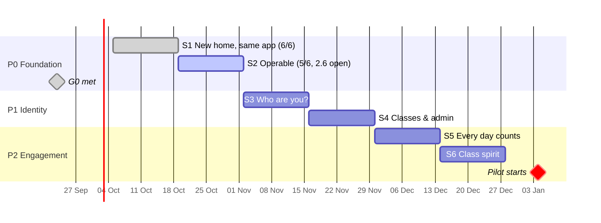
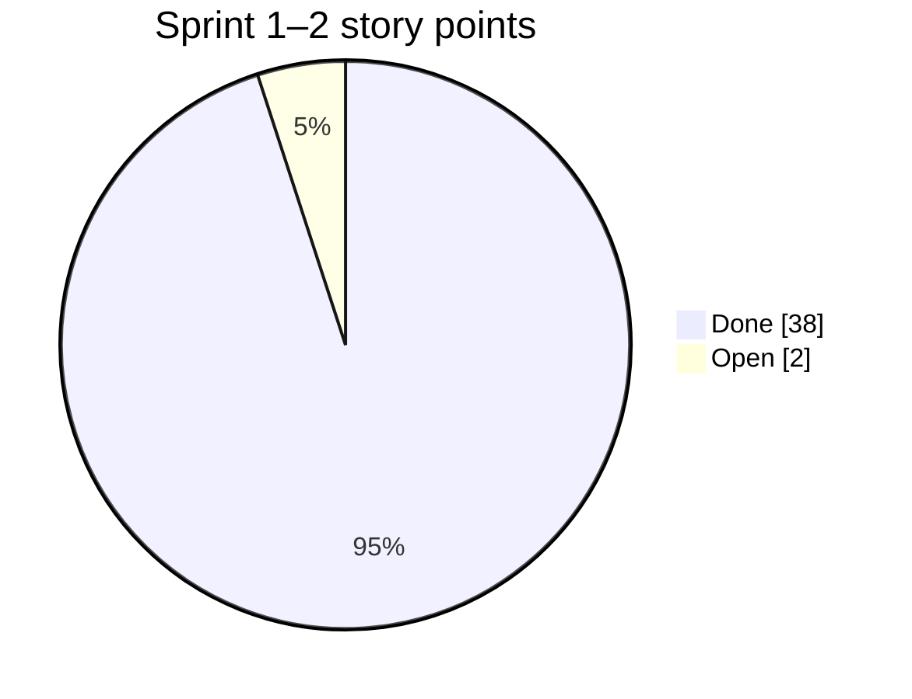

# Suffa — Sprint Plan (S1–S16)

v2 (2026-09-24): re-sequenced for the teacher pilot (engagement + recordings before AI).
Two-week sprints; estimates in story points (1 pt ≈ half a day); target ≈ 20 pts/sprint.

**Definition of Done (every story):** code + tests (unit/integration as relevant) · lint,
typecheck, test green in CI · docs/ADR updated · deployed to staging · acceptance criteria
demoed · no secrets in code · structured logs on new paths.

---

## Progress (as of 2026-09-23)

Sprints 1–2 (P0) were planned for Oct 5 – Nov 1 and shipped early, except 2.6. Gate G0 is met
(one-command deploy, restore drill passed). Dates of later sprints are kept as buffer.

| Story                   | Status | Notes                                                                                                                                          |
| ----------------------- | ------ | ---------------------------------------------------------------------------------------------------------------------------------------------- |
| 1.1 workspaces          | ✅     | `apps/web`, `apps/api`; `packages/*` follow when code is first shared                                                                          |
| 1.2 CI                  | ✅     | plus: releases are gated on CI and on image smoke tests                                                                                        |
| 1.3 api skeleton        | ✅     |                                                                                                                                                |
| 1.4 schema + migrations | ✅     | plain SQL migrations with an own runner (advisory lock); Drizzle not adopted yet                                                               |
| 1.5 Dockerfiles         | ✅     | ffmpeg is added to the api image with the recordings pipeline (S7)                                                                             |
| 1.6 first deploy        | ✅     | full stack live on CapRover                                                                                                                    |
| 2.1 release workflow    | ✅     |                                                                                                                                                |
| 2.2 apps + queue        | ✅     | pg-boss queues + dead-letter queue; worker runs a daily maintenance job; `/healthz` reports live queue depth                                   |
| 2.3 backups             | ✅     | `suffa-backup` app: nightly verified pg_dump → RustFS (versioning + object lock, write-only key); restore drill done; off-site copy still open |
| 2.4 error tracking      | ✅     | GlitchTip (template, no Redis): api, worker and web report with release tag; browser via `/api/errors` tunnel; uptime monitors                 |
| 2.5 sync endpoints      | ✅     | `/api/v1/sync/:table/push\|pull`; closed (401) until Better Auth (S3), dev tokens outside prod only                                            |
| 2.6 browser router      | ☐      |                                                                                                                                                |

## P0 — Foundation

### Sprint 1 (Oct 5 – Oct 18) — _"New home, same app"_

| #   | Story                                                                                                           | Pts | Acceptance                                              |
| --- | --------------------------------------------------------------------------------------------------------------- | --- | ------------------------------------------------------- |
| 1.1 | npm workspaces; `src/` → `apps/web`, SRS → `packages/srs`, types → `packages/shared` (ADR-0006)                 | 5   | All existing tests pass from root; PWA build identical. |
| 1.2 | CI workflow: lint, typecheck, test, build on PR + main                                                          | 3   | PR blocked on failure.                                  |
| 1.3 | `apps/api` skeleton: Hono, pino, zod env (refuse placeholder secrets in prod), `/healthz`                       | 3   | Fails fast with clear message on bad env.               |
| 1.4 | Drizzle + Postgres 17/pgvector: migrations for the 5 sync tables + `users`; migrate-on-start with advisory lock | 3   | Idempotent; Testcontainers integration test.            |
| 1.5 | Dockerfiles: `suffa-web` (Caddy, CSP, `/api` + `/media` proxy), `suffa-api` (with ffmpeg)                       | 3   | Images run locally with `compose.dev.yaml`.             |
| 1.6 | First CapRover deploy of `suffa-web` (static PWA) next to Tabayyun                                              | 3   | `https://suffa.<domain>` serves the app.                |

### Sprint 2 (Oct 19 – Nov 1) — _"Operable"_

| #   | Story                                                                                               | Pts | Acceptance                                                 |
| --- | --------------------------------------------------------------------------------------------------- | --- | ---------------------------------------------------------- |
| 2.1 | Release workflow: GHCR images + `caprover/deploy-from-github` for api/web/worker (Tabayyun pattern) | 5   | Push to main deploys in < 10 min; skipped when vars unset. |
| 2.2 | `suffa-db`, `suffa-api`, `suffa-worker` apps; pg-boss queue + worker role (ADR-0020)                | 3   | `/healthz` shows schema revision + queue depth.            |
| 2.3 | Backups: nightly `pg_dump` → off-box; restore drill                                                 | 3   | Restore documented and tested.                             |
| 2.4 | Error tracking + uptime check                                                                       | 2   | Test error visible with release tag.                       |
| 2.5 | Sync endpoints `push`/`pull` (contract = `SyncProvider`)                                            | 5   | Existing sync engine suite passes against the server.      |
| 2.6 | `createBrowserRouter` behind Caddy SPA fallback                                                     | 2   | Deep links + offline navigation work.                      |

**Gate G0.**

## P1 — Identity, roles & classes

### Sprint 3 (Nov 2 – Nov 15) — _"Who are you?"_

| #   | Story                                                                          | Pts | Acceptance                                            |
| --- | ------------------------------------------------------------------------------ | --- | ----------------------------------------------------- |
| 3.1 | Better Auth: magic link, password, passkeys; SMTP; auth rate limits (ADR-0008) | 5   | Sign-in on two devices; tokens never in localStorage. |
| 3.2 | `authz/` policies + route middleware (ADR-0009)                                | 5   | Route × role matrix test green.                       |
| 3.3 | `ApiSyncProvider` + env selection                                              | 5   | Sync suite green; user bound to session.              |
| 3.4 | Account UI: methods, sessions, sign out others; time-zone setting              | 3   | Revoked session fails within 60 s.                    |
| 3.5 | Security review auth + sync                                                    | 2   | Findings fixed or ticketed.                           |

### Sprint 4 (Nov 16 – Nov 29) — _"Classes & admin"_

| #   | Story                                                                              | Pts | Acceptance                                            |
| --- | ---------------------------------------------------------------------------------- | --- | ----------------------------------------------------- |
| 4.1 | Supabase → Postgres migration (preserve UUIDs), cut-over                           | 5   | Checksums match; users see their cards.               |
| 4.2 | Admin panel shell + users (search, paginate, role, disable) + audit log; admin 2FA | 5   | Every change audit-logged.                            |
| 4.3 | Classes: create, invite link + QR, join flow, membership approval                  | 5   | Student joins via QR on a phone.                      |
| 4.4 | GDPR export + account deletion                                                     | 3   | Export has all data; delete cascades.                 |
| 4.5 | Pilot kick-off interview with the teacher (PO)                                     | 2   | Class profile, consent approach, schedule documented. |

**Gate G1.**

## P2 — Engagement (pilot readiness)

### Sprint 5 (Nov 30 – Dec 13) — _"Every day counts"_

| #   | Story                                                                                                                | Pts | Acceptance                                                        |
| --- | -------------------------------------------------------------------------------------------------------------------- | --- | ----------------------------------------------------------------- |
| 5.1 | `packages/engagement`: XP rules, daily quest generator, achievement evaluator, TZ-correct streak, shields (ADR-0016) | 5   | Pure, 100 % branch coverage on rules; same output offline/online. |
| 5.2 | "Today" card on Dashboard: 3 quests, progress, bonus; XP toasts                                                      | 5   | Works fully offline.                                              |
| 5.3 | Badge gallery + level + unit mastery rings                                                                           | 3   | Badges never lost after reinstall (synced).                       |
| 5.4 | Server recompute job + tables (`xp_ledger`, `quest_progress`, `achievement_unlocks`) with plausibility checks        | 5   | Client reconciles to server values; cheating fixtures rejected.   |
| 5.5 | Weekly goal (3/5/7 days) + weekly streak                                                                             | 2   | Missed day doesn't break a met weekly goal.                       |

### Sprint 6 (Dec 14 – Dec 27) — _"Class spirit"_ (holiday-reduced: 16 pts)

| #   | Story                                                                                  | Pts | Acceptance                             |
| --- | -------------------------------------------------------------------------------------- | --- | -------------------------------------- |
| 6.1 | Class dashboard: activity, quests done, mastery per unit, leech words (teacher-scoped) | 5   | Teacher sees only own classes.         |
| 6.2 | Class weekly challenge (templates) + teacher custom badges + shout-outs                | 5   | Challenge progress updates after sync. |
| 6.3 | Web Push (VAPID) + reminder time, quiet hours; `Notifier` abstraction                  | 3   | Max 1 reminder/day; skipped if done.   |
| 6.4 | Weekly recap (in-app + push/email)                                                     | 3   | Generated Sunday in user's TZ.         |

**Gate G2 → Pilot starts Mon 2027-01-04.**

## P3 — Teacher recordings

### Sprint 7 (Dec 28 – Jan 10) — _"Bring the sessions in"_

| #   | Story                                                                                             | Pts | Acceptance                                                           |
| --- | ------------------------------------------------------------------------------------------------- | --- | -------------------------------------------------------------------- |
| 7.1 | `ObjectStorage` (S3 SDK) on shared RustFS; buckets + key; `/media` presigned via Caddy (ADR-0017) | 3   | Range requests work; RustFS not public.                              |
| 7.2 | Google Drive connect (`drive.file`) + Picker; encrypted refresh token; import job (ADR-0018)      | 5   | Teacher picks 3 files → originals in RustFS.                         |
| 7.3 | Direct multipart upload (≥ 2 GB files)                                                            | 3   | Resumes after network drop.                                          |
| 7.4 | Transcode pipeline (audio Opus/AAC + 720p MP4), progress in UI                                    | 5   | 1 h recording processed without disturbing Tabayyun (concurrency 1). |
| 7.5 | `media_items` + hosted-media player + `media_progress` sync                                       | 4   | Progress syncs across devices.                                       |

### Sprint 8 (Jan 11 – Jan 24) — _"Make them interactive"_

| #   | Story                                                                       | Pts | Acceptance                                               |
| --- | --------------------------------------------------------------------------- | --- | -------------------------------------------------------- |
| 8.1 | Transcription (faster-whisper in worker or HF endpoint) + transcript editor | 5   | Teacher can correct cues; per-class AI switch respected. |
| 8.2 | Checkpoint engine + timeline editor (shared with YouTube later)             | 5   | ±0.5 s trigger; mcq/dictation/vocab_flash.               |
| 8.3 | Publish flow with consent confirmation; class-only access                   | 2   | Non-members get 403.                                     |
| 8.4 | Offline audio download                                                      | 3   | Plays in flight mode; checkpoints work.                  |
| 8.5 | Assignments v1 (units, recordings, due dates) → class quests                | 5   | Students see assignment quests on "Today".               |

**Gate G3.**

## P4 — AI teacher

### Sprint 9 (Jan 25 – Feb 7) — _"Gateway"_

| #   | Story                                                                                             | Pts | Acceptance                                                |
| --- | ------------------------------------------------------------------------------------------------- | --- | --------------------------------------------------------- |
| 9.1 | `packages/llm`: interfaces + `AnthropicProvider` (official SDK, streaming, caching, typed errors) | 5   | Fixture tests; cache reads > 0 on 2nd call.               |
| 9.2 | `OpenRouterProvider` + `HuggingFaceProvider`                                                      | 5   | Shared contract suite green.                              |
| 9.3 | `ModelRouter` + `ai_model_routes` + capability checks + fallbacks                                 | 3   | Route change live in ≤ 60 s.                              |
| 9.4 | Metering + quotas in Postgres + budget downgrade                                                  | 5   | Over-quota → friendly 429; spend within ±5 % of provider. |
| 9.5 | Admin AI page v1 (routes, spend)                                                                  | 2   | Model per task editable.                                  |

### Sprint 10 (Feb 8 – Feb 21) — _"al-Muʿallim speaks"_

| #    | Story                                                                                      | Pts | Acceptance                                 |
| ---- | ------------------------------------------------------------------------------------------ | --- | ------------------------------------------ |
| 10.1 | Tutor API (SSE), curriculum pack + learner snapshot; tutoring language de/en (ADR-0021)    | 5   | First token p50 < 1.5 s.                   |
| 10.2 | Tools: lookup_vocab, get_root_family, get_learner_state, get_media_segment (authz-checked) | 5   | No cross-user access (test).               |
| 10.3 | Tutor UI module; "ask about this minute" in recordings                                     | 5   | RTL + tashkīl level correct; 👍/👎 stored. |
| 10.4 | Validators + repair retry; tutor produce-quests                                            | 5   | Fixture-tested.                            |

### Sprint 11 (Feb 22 – Mar 7) — _"Grading & evals"_

| #    | Story                                                                     | Pts | Acceptance                           |
| ---- | ------------------------------------------------------------------------- | --- | ------------------------------------ |
| 11.1 | Grade mode (writing, transcribed speech), mistakes → SRS                  | 5   | Structured rubric; cards via outbox. |
| 11.2 | Teacher review queue with overrides → eval cases                          | 5   | Overrides exported.                  |
| 11.3 | Eval harness in CI with budget cap                                        | 5   | Regression fails the job.            |
| 11.4 | AI-suggested chapters/vocab/checkpoints for recordings (teacher approves) | 5   | Never auto-published.                |

**Gate G4.**

## P5 — Interactive YouTube

### Sprint 12 (Mar 8 – Mar 21)

| #    | Story                                                                              | Pts | Acceptance                       |
| ---- | ---------------------------------------------------------------------------------- | --- | -------------------------------- |
| 12.1 | YouTube import job (Data API v3) for Muhammad al-Andalusi playlists; catalog admin | 5   | Videos mapped to units.          |
| 12.2 | YouTube source in the shared player (IFrame API, nocookie)                         | 5   | Checkpoints work on iOS/Android. |
| 12.3 | Transcripts + tap-to-gloss where permitted (`permission_status`)                   | 5   | Hidden when not granted.         |
| 12.4 | Outreach + permission tracking (PO)                                                | 1   | Status recorded.                 |
| 12.5 | Lesson quests from YouTube lessons                                                 | 2   | Count toward daily quests.       |

## P6 — Mobile apps

### Sprint 13 (Mar 22 – Apr 4) — _"In their pocket"_

| #    | Story                                                                              | Pts | Acceptance                            |
| ---- | ---------------------------------------------------------------------------------- | --- | ------------------------------------- |
| 13.1 | `apps/mobile` Capacitor (iOS/Android), secure token storage, deep links (ADR-0019) | 5   | Magic-link + join links open the app. |
| 13.2 | Local notifications (daily reminder offline) + FCM push                            | 5   | Reminder fires in flight mode.        |
| 13.3 | Offline audio via filesystem, background playback                                  | 3   | Lock-screen controls.                 |
| 13.4 | TestFlight + Play internal testing with the class                                  | 3   | ≥ 10 students on test builds.         |
| 13.5 | Store assets, privacy labels, age rating                                           | 2   | Submitted for review.                 |

### Sprint 14 (Apr 5 – Apr 18) — _"Celebrate"_

| #    | Story                                       | Pts | Acceptance                        |
| ---- | ------------------------------------------- | --- | --------------------------------- |
| 14.1 | Store release (fix review feedback)         | 3   | Live in both stores.              |
| 14.2 | Opt-in weekly leagues (by % of weekly goal) | 5   | Off by default for minors.        |
| 14.3 | Unit certificates (PDF)                     | 3   | Teacher can award/print.          |
| 14.4 | Live class quiz (teacher-led, leech words)  | 5   | Works for 30 concurrent students. |

**Gate G5.**

## P7 — Next level

- **Sprint 15 (Apr 19 – May 2):** pronunciation assessment (ADR-0022): G2P for vocalised
  MSA, evaluation harness on consented pilot recordings, ASR assessor as default and phoneme
  assessor if it wins the evaluation; FSRS behind
  `schedule()` with migration flag.
- **Sprint 16 (May 3 – May 16):** content CMS + offline bundles (ADR-0014); English UI,
  per-language glosses and meaning-language setting (ADR-0021);
  WCAG 2.2 AA audit; `v2.2`.

---

## Shipped outside the plan

- **2026-09-23 — tolerant answer checking:** translations accept any one of several meanings,
  optional parts, articles, umlaut spellings and small typos; the other meanings are shown after
  answering; German answers are typed left-to-right (was: Arabic input style). Pilot data from
  January also feeds the pronunciation evaluation (ADR-0022).
- **2026-09-23 — iPhone recording and pronunciation rating:** format detection (`audio/mp4`),
  timeouts and concrete German help texts instead of silent failures.
- **2026-09-23 — security updates:** React Router 7, uuid 11.1; `npm audit` clean for
  production dependencies.

## Backlog (unscheduled)

Arabic UI (RTL chrome) · Book 2 · SSO via Tabayyun's Keycloak/Zitadel (shared IdP) ·
multi-node Swarm · pgvector RAG over all transcripts · parent accounts for minors.
