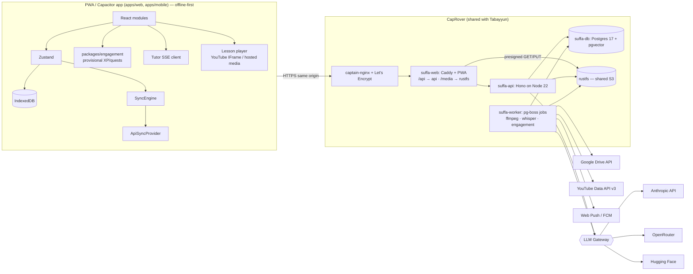

# 02 — Technical Specification

- Status: draft v2 · Date: 2026-09-24
- Decisions referenced: ADR-0006 … ADR-0020 · Deployment runbook: `docs/ops/caprover-deployment.md`

## 1. Target architecture



**Principles:** the device stays the source of truth for learning state (ADR-0002); the server
owns identity, authorisation, shared content, AI, and aggregates. Secrets never reach the browser.

## 2. Repository layout (ADR-0006)

```
apps/
  web/            ← today's src/ moves here unchanged (Vite PWA)
  api/            ← Hono HTTP API (auth, sync, tutor, admin, teacher, media); same image runs the worker
  mobile/         ← Capacitor shell for iOS/Android around the web build (ADR-0019)
packages/
  shared/         ← zod schemas + TS types shared by web/api (SrsCard, SyncTable, DTOs)
  srs/            ← pure SRS engine (moved from services/srs; used by web + worker analytics)
  llm/            ← LlmProvider interface + Anthropic/OpenRouter/HF adapters + router
  content/        ← curriculum JSON + validators + offline-bundle builder
  engagement/     ← pure XP / quest / achievement rules (web + worker, ADR-0016)
  storage/        ← ObjectStorage interface + S3 (RustFS) implementation (ADR-0017)
infra/
  caprover/       ← captain-definition files (api, web), as in Tabayyun
  caddy/          ← Caddyfile for suffa-web
docs/
```

npm workspaces (no extra tooling). The worker is the api image started with `SUFFA_ROLE=worker`. Each package has its own `tsconfig`, `vitest` config, and
`lint` target; root scripts fan out (`npm run test -ws`).

## 3. Backend stack

| Concern             | Choice                                                         | Why (short)                                                                          |
| ------------------- | -------------------------------------------------------------- | ------------------------------------------------------------------------------------ |
| HTTP                | **Hono** on Node 22                                            | Tiny, typed, Web-standard `Request/Response`, first-class SSE streaming.             |
| Validation          | **zod** (from `packages/shared`)                               | One schema for client + server.                                                      |
| DB                  | **Postgres 17 + pgvector** + **Drizzle ORM**; migrate on start | SQL-first, typed. Pool via `pg` (`max` per env).                                     |
| Auth                | **Better Auth** (ADR-0008)                                     | Self-hosted, magic link + password + passkeys + OAuth, admin & organization plugins. |
| Jobs                | **pg-boss** (Postgres queue, ADR-0020)                         | Retries, cron, no Redis — same approach as Tabayyun.                                 |
| Rate limit / quotas | Postgres counters + in-process token bucket                    | One fewer stateful service.                                                          |
| Files               | **RustFS** (shared, S3 API) via `packages/storage` (ADR-0017)  | Recordings, audio, bundles; served via Caddy `/media`.                               |
| Media processing    | ffmpeg + faster-whisper (or HF Whisper) in the worker          | Transcode + transcripts for teacher recordings (ADR-0018).                           |
| Notifications       | Web Push (VAPID), FCM, Capacitor local notifications           | `Notifier` abstraction (ADR-0019).                                                   |
| Email               | SMTP via env (Brevo/Postmark/Resend/self-hosted)               | Magic links, invites.                                                                |
| Logs                | pino (JSON) → stdout → CapRover logs; optional Loki            | Structured, context-aware (`reqId`, `userId`, `route`).                              |
| Errors              | Sentry-compatible (GlitchTip self-hosted on CapRover)          | Web + API.                                                                           |

## 4. Data model (Postgres)

Existing sync tables keep their shape and `(user_id, id)` PK (`supabase/schema.sql`), with
`user_id` referencing our `users` table instead of `auth.users`.

```sql
-- identity (managed by Better Auth; names illustrative)
users(id uuid pk, email citext unique, name text, role text check (role in ('student','teacher','admin')) default 'student',
      locale text default 'de', disabled_at timestamptz, created_at, updated_at)
sessions(...), accounts(...), verifications(...), passkeys(...)          -- Better Auth tables

-- classes & RBAC (ADR-0009)
classes(id uuid pk, name text, owner_id uuid fk users, invite_code text unique, settings jsonb, archived_at, created_at)
class_members(class_id fk, user_id fk, class_role text check (class_role in ('teacher','student')), joined_at,
              primary key (class_id, user_id))
assignments(id uuid pk, class_id fk, title, kind text, payload jsonb, due_at, created_by fk, created_at)
assignment_submissions(assignment_id fk, user_id fk, status text, score numeric, ai_feedback jsonb,
              teacher_override jsonb, updated_at, primary key (assignment_id, user_id))

-- learning data (sync, unchanged columns)
srs_cards, review_logs, exam_results, settings, user_vocab   -- PK (user_id, id), index (user_id, updated_at)
media_progress(user_id, id, media_id, watched_ratio, checkpoint_results jsonb, updated_at, deleted)  -- new sync table

-- content CMS (ADR-0014)
content_units(id int pk, version int, status text, data jsonb, published_at, updated_by)
content_releases(version int pk, bundle_url text, checksum text, created_at, created_by)

-- media lessons: YouTube + teacher recordings (ADR-0012, ADR-0018)
video_channels(id text pk /* YouTube channelId */, title, handle, permission_status text, notes)
media_items(id uuid pk, source text check (source in ('youtube','hosted')), youtube_id text null, channel_id fk null,
            owner_id fk users, class_ids uuid[], title, duration_s int, unit int null,
            status text /* importing|processing|review|published|unavailable */, consent_confirmed_at, meta jsonb)
media_assets(id uuid pk, media_id fk, kind text /* original|video_720p|audio */, bucket text, object_key text,
             bytes bigint, mime text, created_at)
media_segments(id uuid pk, media_id fk, start_s int, end_s int, title, unit int)
media_checkpoints(id uuid pk, media_id fk, at_s int, kind text, payload jsonb, sort int, suggested_by_ai boolean)
media_transcripts(media_id fk, lang text, source text, cues jsonb, licensed boolean, primary key (media_id, lang))
drive_connections(user_id fk pk, google_sub text, refresh_token_enc bytea, scopes text, connected_at, revoked_at)
import_jobs(id uuid pk, media_id fk, source text /* drive|upload|youtube */, source_ref text, state text, error text, updated_at)

-- engagement (ADR-0016) — server-authoritative, derived from synced events
xp_ledger(id bigserial pk, user_id fk, day date /* user's TZ */, source text, ref text, xp int, rules_version int)
quest_progress(user_id fk, day date, quest_id text, target int, progress int, completed_at, primary key (user_id, day, quest_id))
achievement_defs(id text pk, category text, tier smallint, name_ar text, name_de text, name_en text, rule jsonb, hidden boolean)
achievement_unlocks(user_id fk, achievement_id fk, unlocked_at, primary key (user_id, achievement_id))
streaks(user_id fk pk, daily_current int, daily_best int, weekly_current int, shields smallint, weekly_goal smallint, updated_at)
class_challenges(id uuid pk, class_id fk, week date, metric text, target int, progress int, reached_at, created_by fk)
teacher_badges(id uuid pk, class_id fk, name, icon text, message text, created_by fk)
teacher_badge_awards(badge_id fk, user_id fk, awarded_at, note text, primary key (badge_id, user_id))
push_subscriptions(id uuid pk, user_id fk, channel text /* webpush|fcm */, endpoint text, keys jsonb, device text, created_at)
notification_prefs(user_id fk pk, reminder_local_time time, quiet_start time, quiet_end time, prayer_quiet boolean, email_recap boolean)

-- AI (ADR-0010/0011)
ai_conversations(id uuid pk, user_id fk, mode text, context jsonb, created_at, archived_at)
ai_messages(id uuid pk, conversation_id fk, role text, content jsonb, provider text, model text,
            input_tokens int, output_tokens int, cache_read_tokens int, cost_micros bigint, latency_ms int,
            feedback smallint null, created_at)
ai_usage_daily(user_id, day date, tokens_in bigint, tokens_out bigint, cost_micros bigint, primary key (user_id, day))
ai_model_routes(task text pk, provider text, model text, params jsonb, fallback jsonb, updated_by, updated_at)
prompt_versions(id text pk, task text, body text, created_at, active boolean)

audit_log(id bigserial pk, actor_id, action text, target text, before jsonb, after jsonb, at timestamptz default now())
```

Indexes: every FK; `(user_id, updated_at)` on sync tables; `ai_messages(conversation_id, created_at)`;
`ai_usage_daily(day)`; `media_items(unit, status)`; `xp_ledger(user_id, day)`; `quest_progress(day)`; `audit_log(at desc)`. All list endpoints are
**keyset-paginated** (`?cursor=&limit=`, max 100).

## 5. API surface (v1, JSON, `/v1`)

| Area          | Endpoints                                                                                                                                                                                                                                         | Authz                               |
| ------------- | ------------------------------------------------------------------------------------------------------------------------------------------------------------------------------------------------------------------------------------------------- | ----------------------------------- |
| Auth          | `/v1/auth/*` (Better Auth handler)                                                                                                                                                                                                                | public                              |
| Me            | `GET /me`, `PATCH /me`, `GET /me/export`, `DELETE /me`                                                                                                                                                                                            | self                                |
| Sync          | `POST /sync/:table/push`, `GET /sync/:table/pull?since=`                                                                                                                                                                                          | self; table whitelist               |
| Content       | `GET /content/manifest`, `GET /content/bundle/:version` (ETag, immutable)                                                                                                                                                                         | public                              |
| Tutor         | `POST /tutor/conversations`, `POST /tutor/conversations/:id/messages` (**SSE**), `POST /tutor/grade`, `POST /tutor/exercises`, `POST /ai-messages/:id/feedback`                                                                                   | self + quota                        |
| Media         | `GET /media?unit=&class=`, `GET /media/:id` (segments, checkpoints, transcript, presigned asset URLs)                                                                                                                                             | signed-in; class members for hosted |
| Recordings    | `POST /drive/connect`, `DELETE /drive/connect`, `POST /recordings/import` (Picker file ids), `POST /recordings/uploads` (presigned multipart), `PATCH /recordings/:id` (transcript, checkpoints), `POST /recordings/:id/publish`                  | class teacher                       |
| Engagement    | `GET /me/engagement` (XP, level, streaks, quests today, badges), `PUT /me/weekly-goal`, `GET /classes/:id/challenge`, `PUT /classes/:id/challenge`, `POST /classes/:id/badges`, `POST /badges/:id/award`, `GET /classes/:id/leaderboard` (opt-in) | self / class teacher                |
| Notifications | `POST /push/subscriptions`, `DELETE /push/subscriptions/:id`, `PUT /me/notification-prefs`, `POST /classes/:id/announcements`                                                                                                                     | self / class teacher                |
| Teacher       | `/classes`, `/classes/:id/members`, `/classes/:id/progress`, `/classes/:id/assignments`, `/submissions/:id/override`                                                                                                                              | class teacher                       |
| Admin         | `/admin/users`, `/admin/classes`, `/admin/content/*`, `/admin/videos/import`, `/admin/ai/routes`, `/admin/ai/usage`, `/admin/audit`                                                                                                               | admin                               |
| Ops           | `GET /healthz`, `GET /readyz`                                                                                                                                                                                                                     | internal                            |

The sync contract is identical to today's `SyncProvider` (`push(table, records)`,
`pull(table, since)`), so `ApiSyncProvider` is a drop-in replacement for `SupabaseSyncProvider`.
Server enforces `user_id` from the session — never from the payload (same guarantee RLS gives today).

## 6. LLM gateway (ADR-0010)

```ts
// packages/llm/src/types.ts
export interface ChatRequest {
  task: LlmTask; // 'tutor.converse' | 'tutor.explain' | 'grade.writing' | 'exercise.generate' | ...
  system: SystemBlock[]; // stable, cacheable prefix first
  messages: ChatMessage[];
  tools?: ToolSpec[];
  responseSchema?: ZodTypeAny; // structured output when the provider supports it
  maxTokens: number;
  userRef: string; // hashed user id for provider abuse tracking
}
export interface LlmProvider {
  readonly id: 'anthropic' | 'openrouter' | 'huggingface';
  stream(req: ChatRequest, signal: AbortSignal): AsyncIterable<ChatEvent>; // text deltas, tool calls, usage
  complete(req: ChatRequest, signal: AbortSignal): Promise<ChatResult>;
}
export interface ModelRouter {
  resolve(task: LlmTask, ctx: { role: Role; budgetState: BudgetState }): RouteDecision; // provider + model + params + fallbacks
}
```

- **Anthropic adapter** uses the official `@anthropic-ai/sdk` (streaming, prompt caching,
  adaptive thinking with `output_config.effort`, structured outputs, typed errors).
- **OpenRouter adapter** uses OpenRouter's OpenAI-compatible chat endpoint for non-Claude models
  (Qwen, Llama, Mistral, Gemma, Jais/ALLaM where available).
- **Hugging Face adapter** uses HF Inference Providers (chat completion) or a dedicated
  Inference Endpoint URL — also for embeddings and Whisper STT (ADR-0015).
- Router table `ai_model_routes` is editable in the admin panel; defaults in §6.1.
- Every call is metered (`ai_messages`, `ai_usage_daily`) and checked against quotas **before**
  it is sent (Postgres counters, ADR-0020) — see `plan/cost-plan.md` §4.

### 6.1 Default routing (changeable at runtime)

| Task                                | Primary                                             | Fallback              | Rationale                                    |
| ----------------------------------- | --------------------------------------------------- | --------------------- | -------------------------------------------- |
| `tutor.converse`, `tutor.explain`   | Anthropic `claude-sonnet-5` (effort `low`/`medium`) | OpenRouter open model | Best Arabic quality/price for dialogue.      |
| `grade.writing`, `grade.speech`     | Anthropic `claude-sonnet-5` (structured output)     | `claude-haiku-4-5`    | Needs reliable rubric + JSON.                |
| `exercise.generate` (bulk, offline) | Anthropic Batch API `claude-haiku-4-5`              | OpenRouter open model | 50 % batch discount, teacher reviews output. |
| `tutor.coach` (weekly plan)         | `claude-haiku-4-5`                                  | —                     | Short, cheap.                                |
| `content.author-assist` (admin)     | `claude-opus-5`                                     | `claude-sonnet-5`     | Rare, quality-critical.                      |
| `embed.*`                           | HF sentence-embedding model                         | —                     | RAG over curriculum + transcripts.           |
| `stt.*`                             | HF Whisper (large-v3 / turbo)                       | browser STT           | Pronunciation (ADR-0015).                    |

## 7. al-Muʿallim internals (ADR-0011)

- **Prompt layout (cache-friendly):** `[persona + pedagogy rules]` → `[unit curriculum pack]`
  (both cached) → `[learner snapshot: level, due/leech words, settings]` → conversation.
- **Tools** (server-executed, scoped to the caller's `userId`):
  `lookup_vocab(query)`, `get_root_family(root)`, `get_learner_state()`,
  `propose_srs_cards(items[])` (client confirms → outbox), `make_exercise(spec)`,
  `get_media_segment(mediaId, t)`.
- **Validators** after generation: tashkīl coverage check, Arabic-script sanity, JSON schema,
  banned-topic filter; failed validation → one repair retry → graceful message.
- **Evals:** golden set of ~200 prompts per task (grammar explanations, grading cases with
  teacher-labelled scores); run in CI on prompt/model change with a small budget; teacher
  overrides feed new cases.

## 8. Deployment on CapRover (ADR-0013, ADR-0017, ADR-0020)

Same pattern as Tabayyun; full runbook in `docs/ops/caprover-deployment.md`.

| CapRover app   | Image                                                | Persistent  | Notes                                                                   |
| -------------- | ---------------------------------------------------- | ----------- | ----------------------------------------------------------------------- |
| `suffa-web`    | `ghcr.io/thedatadudech/suffa-web` (Caddy + PWA)      | no          | Public domain; proxies `/api` → api, `/media` → rustfs; CSP             |
| `suffa-api`    | `ghcr.io/thedatadudech/suffa-api` (Node 22 + ffmpeg) | no          | Port 8000; migrates DB on start                                         |
| `suffa-worker` | same image, `SUFFA_ROLE=worker`                      | `/data/tmp` | pg-boss jobs: imports, transcode, whisper, engagement, push             |
| `suffa-db`     | `pgvector/pgvector:<pinned>-pg17`                    | yes         | Plain app, internal only; nightly `pg_dump` off-box                     |
| `rustfs`       | existing (shared with Tabayyun)                      | yes         | Buckets `suffa-media`, `suffa-uploads`, `suffa-content`; Suffa-only key |

CI (GitHub Actions): lint → typecheck → test → build images → GHCR →
`caprover/deploy-from-github@v2` with per-app tokens (`CAPROVER_APP_TOKEN_API|WEB|WORKER`).
Env vars are set per app in CapRover — never in the repo.

## 9. Conventions

- New code and APIs in **English**; established domain terms stay (`wurzel`, `wazn`, `einheit`)
  and are aliased in `packages/shared` DTOs to avoid a breaking content rename.
- ADRs for every decision that is hard to reverse; `TODO(YYYY-MM-DD):` format.
- Conventional commits; PRs must be green on lint/typecheck/test.

## 10. Security checklist (summary)

Server-side authz middleware per route group; zod validation on every input; parameterised
SQL only (Drizzle); web and API are same-origin behind Caddy (no CORS), cookies
`SameSite=Lax` + origin check, bearer tokens in secure storage for native apps; CSP allowing
only YouTube/Google Picker frames and same-origin `/media`; RustFS never public, presigned URLs
≤ 15 min; Google refresh tokens encrypted at rest; rate limits (auth, tutor); audit log
for privileged actions; prompt-injection hardening (tools re-check authz, never trust model
output for authorisation, transcripts treated as untrusted data); dependency scanning in CI.

## 11. Testing strategy

| Level       | Scope                                                                                                                                                            |
| ----------- | ---------------------------------------------------------------------------------------------------------------------------------------------------------------- |
| Unit        | srs, reconcile (existing), engagement rules (quests, XP, streak TZ edge cases), router/quota logic, validators, authz policies                                   |
| Integration | API + real Postgres (Testcontainers) for sync, RBAC, assignments; LLM adapters against recorded fixtures                                                         |
| Contract    | `ApiSyncProvider` runs the existing `tests/sync.engine.integration.test.ts` suite                                                                                |
| E2E         | Playwright: sign-in, join class via link, daily quest completion offline → sync → server XP, recording checkpoint, tutor chat (mock provider), admin role change |
| AI evals    | Golden sets per task, scored in CI on change (budget-capped)                                                                                                     |
